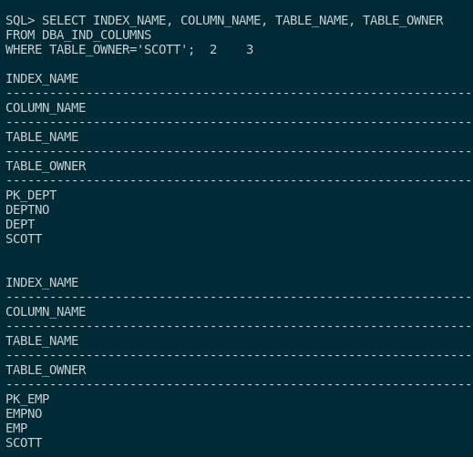
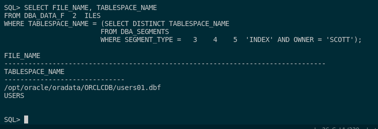

## 2. Realizad una consulta al diccionario de datos que muestre qué índices existen para objetos pertenecientes al esquema de SCOTT y sobre qué columnas están definidos. Averiguad en qué fichero o ficheros de datos se encuentran las extensiones de sus segmentos correspondientes.

Para poder ver los índices de los objetos que pertenecen al esquema `SCOTT` y sobre las columnas en las que está definido, debemos entender lo siguiente.

En la tabla **DBA_IND_COLUMNS** existen atributos que nos pueden servir para esta consulta sobre los índices. En ella se encuentra **INDEX_NAME** que nos muestra el nombre del índice y datos importantes como **COLUMN_NAME, TABLE_NAME y TABLE_OWNER** que se trata de la columna en cuestión (también dicha como clave primaria de la tabla), el nombre de la tabla y el propietario del índice respectivamente.

Por ello, realizaremos la siguiente consulta:

```sql
SELECT INDEX_NAME, COLUMN_NAME, TABLE_NAME, TABLE_OWNER
FROM DBA_IND_COLUMNS
WHERE TABLE_OWNER='SCOTT';
```



Con esta consulta podemos ver los 2 índices creados (que se llaman *PK_DEPT* y *PK_EMP*) con sus repectivos datos indexados a este mismo.

También, si queremos ver en qué fichero o ficheros de datos se encuentran las extensiones de sus segmentos correspondientes, tendremos que mirar en la tabla **DBA_DATA_FILES** como hicimos en la práctica invidual.

En esta tabla tendremos que filtrar por nombre de tablespace (*TABLESPACE_NAME*), para poder entre lazar la tabla de los objetos que nos interesa. Esta tabla es **DBA_SEGMENTS**, en esta tabla podemos poner el tipo de segmento que es índice y el propierario de ella, que es SCOTT. 

Con esto ya tenemos la consulta que nos muestra el archivo que almacena el índice del propietario SCOTT. Esta consulta es la siguiente:

```sql
SELECT FILE_NAME, TABLESPACE_NAME 
FROM DBA_DATA_FILES
WHERE TABLESPACE_NAME = (SELECT DISTINCT TABLESPACE_NAME
                        FROM DBA_SEGMENTS 
                        WHERE SEGMENT_TYPE = 'INDEX' AND OWNER = 'SCOTT');
```



Con esto, vemos que nos da la ruta de este archivo que se encuentra (en mi caso) en **/opt/oracle/oradata/ORCLCDB/users01.dbf** en el tablespace **USERS**.