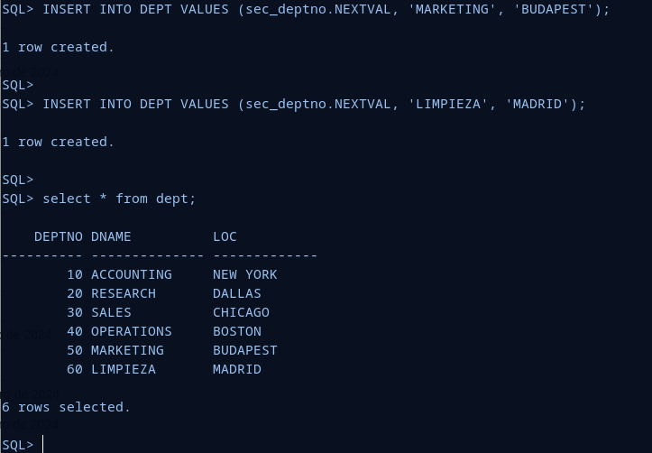

## 3. Cread una secuencia para rellenar el campo deptno de la tabla dept de forma coherente con los datos ya existentes. Insertad al menos dos registros haciendo uso de la secuencia.

Empezaré explicando que es una secuencia en Oracle. Una secuencia es un objeto de base de datos que genera una serie de números en orden secuencial. Estos números pueden ser utilizados para generar valores únicos de clave primaria en una tabla. Una secuencia es independiente de cualquier tabla específica y puede ser compartida por varias tablas en una base de datos.

Una vez creada la secuencia, se puede acceder a los valores que genera utilizando la función **nextval**, que devuelve el siguiente número en la secuencia, o utilizando la función **currval**, que devuelve el número actual de la secuencia sin incrementarlo. Estos valores pueden ser utilizados para insertar registros en una tabla con valores únicos generados automáticamente.

Para la realización de este ejercicio, comenzaré creando la tabla **Dept**.

```sql
CREATE TABLE DEPT (
  DEPTNO NUMBER(2) CONSTRAINT PK_DEPT PRIMARY KEY,
  DNAME VARCHAR2(14),
  LOC VARCHAR2(13));
```

Inserto los registros.

```sql
INSERT INTO DEPT VALUES (10,'ACCOUNTING','NEW YORK');
INSERT INTO DEPT VALUES (20,'RESEARCH','DALLAS');
INSERT INTO DEPT VALUES (30,'SALES','CHICAGO');
INSERT INTO DEPT VALUES (40,'OPERATIONS','BOSTON');
```

Creo la secuencia:

```sql
CREATE SEQUENCE sec_deptno INCREMENT BY 10 START WITH 50;
```

Esta secuencia comenzará en 50, es decir, el primer valor generado será el 50, cada vez que se solicite un nuevo valor de la secuencia, este se incrementará en 10. Así conseguimos que el campo deptno se rellenará con 50, 60, 70....

Al no especificar un máximo, la secuencia continuará generando valores de forma indefinida.

Una vez creada, podemos continuar insertando los registros:

```sql
INSERT INTO DEPT VALUES (sec_deptno.NEXTVAL, 'LIMPIEZA', 'MADRID');

INSERT INTO DEPT VALUES (sec_deptno.NEXTVAL, 'MARKETING', 'BUDAPEST');
```



Como podemos comprobar, la secuencia funciona e inserta los registros requeridos.