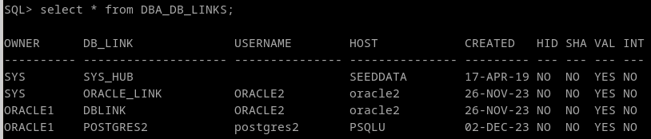
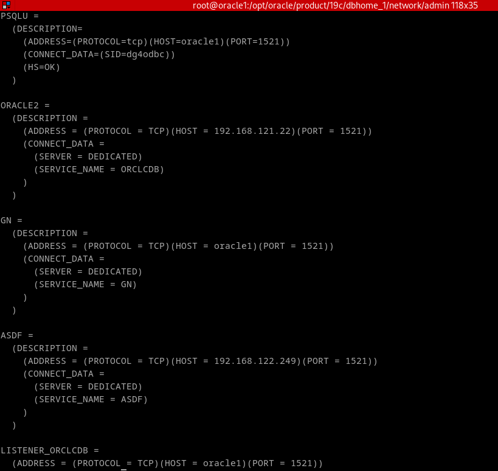

## 4. Queremos limpiar nuestro fichero tnsnames.ora. Averiguad cuales de sus entradas se están usando en algún enlace de la base de datos.


Para averiguar los links que está siendo usados, consultamos la vista DBA_DB_LINKS
```
SELECT * FROM DBA_DB_LINKS
```




Despues vamos al tnsnames.ora, y comparando con los resultados borramos las entradas que no aparezcan. Podemos encontrarlo en $ORACLE_HOME/network/admin.
En mi caso tenemos la primera entrada, que es para una interconexión con oracle, y la segunda, que es para otro oracle.



Cuidado, las entradas en tnsname no sirven exclusivamente para interconexiones, si no también para conexiones remotas por ejemplo. Que no salga en DBA_DB_LINKS no quiere decir que deba ser borrada en cualquier otro caso.

Tras terminar de editar el fichero hacemos un `lnsnrctl reload`.