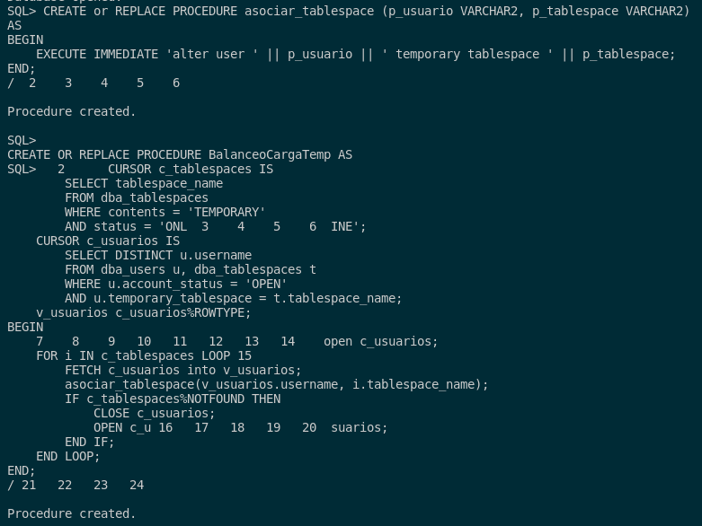
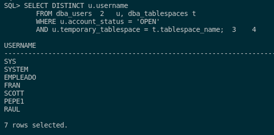
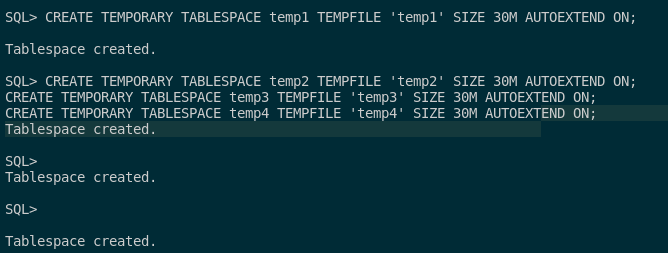
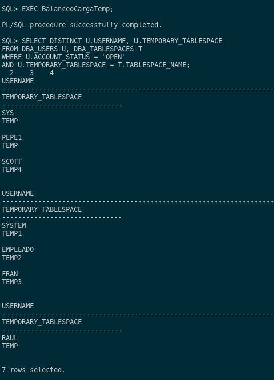

## 6. Realizad un procedimiento llamado BalanceoCargaTemp que balancee la carga de usuarios entre los tablespaces temporales existentes. Para ello averiguará cuántos existen y asignará los usuarios entre ellos de forma equilibrada. Si es necesario para comprobar su funcionamiento, crea tablespaces temporales nuevos.

Para poder realizar el procedimiento, deberemos tener en cuenta que nos harán falta 2 cursores que son los siguientes:

- Un cursor para que nos muestre el nombre de los tablespaces que sean tablespaces temporales y que están activos en el sistema.

- Un cursor para que nos muestre los usuarios que están activos y que tienen un tablespace asignado a este usuario.

Por ello, lo que haremos será sacar el nombre del tablespace filtrando por el estado de ese mismo y si es temporal en la tabla **dba_tablespaces**. 

También para poder obtener los usuarios, tendremos que hacer una consulta con una alteración de tablas entre **dba_tablespaces** y **dba_users** que nos permitirá filtrar por usuarios cuya tablespace que tenga asiganda sea la misma que la temporal.

Tras esto, abrimos el cursos de los usuarios y utilizamos un bucle for para iterar en el segundo cursor (cursor de tablespaces) por cada uno de los tablespaces y asocie a un procedimiento que los asigne automáticamente. Cuando no encuentre tablespaces, cerramos y abrimos el cursor para que nos itere por el siguiente usuario. Así hasta asignar todos los usuarios a todos los tablespaces que sean.

Por último, tendremos que crear un procediemiento que sea llamado por el principal el cual nos ejecute el proceso de asignación de los tablespaces. Lo que haremos será pasar el usuario y el tablespace respectivo para que ejecute un **ALTER USER** a una tablespace temporal. 

Con esto, aquí tenemos los procedimientos:

```sql
CREATE or REPLACE PROCEDURE asociar_tablespace (p_usuario VARCHAR2, p_tablespace VARCHAR2)
AS
BEGIN
    EXECUTE IMMEDIATE 'alter user ' || p_usuario || ' temporary tablespace ' || p_tablespace;
END;
/

CREATE OR REPLACE PROCEDURE BalanceoCargaTemp AS
    CURSOR c_tablespaces IS
        SELECT tablespace_name
        FROM dba_tablespaces
        WHERE contents = 'TEMPORARY'
        AND status = 'ONLINE';
    CURSOR c_usuarios IS
        SELECT DISTINCT u.username 
        FROM dba_users u, dba_tablespaces t
        WHERE u.account_status = 'OPEN'
        AND u.temporary_tablespace = t.tablespace_name;
    v_usuarios c_usuarios%ROWTYPE;
BEGIN
    open c_usuarios;
    FOR i IN c_tablespaces LOOP
        FETCH c_usuarios into v_usuarios;
        asociar_tablespace(v_usuarios.username, i.tablespace_name);
        IF c_tablespaces%NOTFOUND THEN
            CLOSE c_usuarios;
            OPEN c_usuarios;
        END IF;
    END LOOP;
END;
/
```



Las pruebas de funcionamiento son las siguientes:

Primero, veremos los usuarios que están activos como hemos comentado con algún tablespace asignado. Para ello, ejecutamos la consulta del cursor:

```sql
SELECT DISTINCT u.username 
        FROM dba_users u, dba_tablespaces t
        WHERE u.account_status = 'OPEN'
        AND u.temporary_tablespace = t.tablespace_name;
```



Como vemos tenemos estos 7 usuarios y para el uso de este procedimiento, tendremos que crear 4 tablespaces para probar dicho balanceo. Para crear los tablespaces temporales, lo veremos con el siguiente comando:

```sql
CREATE TEMPORARY TABLESPACE temp1 TEMPFILE 'temp1' SIZE 30M AUTOEXTEND ON;
CREATE TEMPORARY TABLESPACE temp2 TEMPFILE 'temp2' SIZE 30M AUTOEXTEND ON;
CREATE TEMPORARY TABLESPACE temp3 TEMPFILE 'temp3' SIZE 30M AUTOEXTEND ON;
CREATE TEMPORARY TABLESPACE temp4 TEMPFILE 'temp4' SIZE 30M AUTOEXTEND ON;
```



Con esto creado, pasamos a ejecutar el procemiento, y para ver si se ha asignado bien realizaremos la siguiente consulta (que es la misma que el procedimiento, simplemente que nos muestra el tablespace temporal que está asigando a cada usuario):

```sql
EXEC BalanceoCargaTemp;

SELECT DISTINCT U.USERNAME, U.TEMPORARY_TABLESPACE
FROM DBA_USERS U, DBA_TABLESPACES T
WHERE U.ACCOUNT_STATUS = 'OPEN'
AND U.TEMPORARY_TABLESPACE = T.TABLESPACE_NAME;
```


