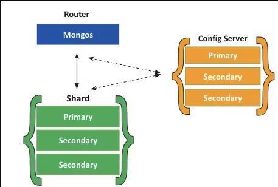

## 7. Explicad en qué consiste el sharding en MongoDB. Intentad montarlo.

Para poder montarlo tenemos que entender en que consiste el sharding en MongoDB.

El **sharding** en MongoDB es una técnica para dividir los datos de una base de datos en fragmentos más pequeños, lo que mejora su rendimiento y capacidad de escalabilidad. Esto se logra distribuyendo los datos en distintos servidores o máquinas, creando fragmentos llamados **shard**. 

Esta distribución equitativa de datos entre máquinas ayuda a gestionar grandes volúmenes de datos y mejora la respuesta del sistema al permitir la lectura y escritura simultánea entre varios servidores.

Por ello, las principales ventajas que puede tener el **sharding** son:

- Mejora la escabilidad y el rendimiento en los datos de nuestra base de datos.

- Podemos dividir el trabajo en una base de datos de varias máquinas.

- Mejoramos el rendimiento de respuesta y permitimos que los datos se lean y se escriban en paralelo en varios servidores.

Además, es importante explicar cómo se reparten los **shards** de manera equitativa entre los grupos de **shards** en un clúster de MongoDB. Estos **shards** se generan a nivel de colección, lo que significa que los documentos de una colección se distribuyen de forma equilibrada entre los distintos **shards** del clúster, y estas divisiones se conocen como **chunks**.

Además, MongoDB ofrece dos tipos de creación para la creación de **shards**:

- `Sharding por Rango`: Aquí, los datos se dividen en rangos según los valores de una clave específica. Luego, cada **shards** se asigna a un rango particular basado en los valores de esa clave.

- `Sharding por Hash`: En esta estrategia, se calcula un hash de la clave. Después, cada **shards** se asigna a un rango determinado según los valores del hash de dicha clave.

Con esto explicado, hemos intentado montar este sistema de Sharding pero no lo hemos conseguido. 
En esta [documentación](https://www.digitalocean.com/community/tutorials/how-to-use-sharding-in-mongodb), lo explica de mejor manera como montarlo. 