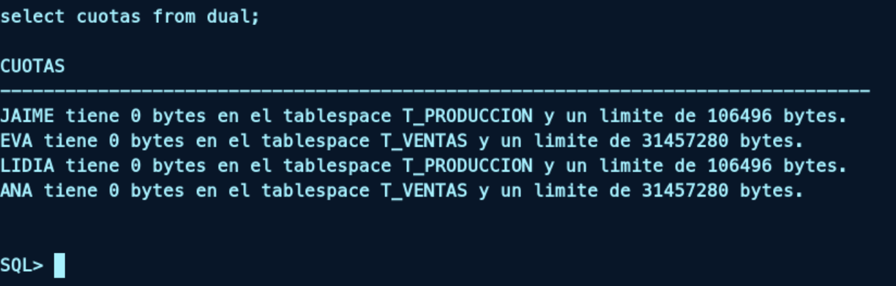

## b) Los espacios de tablas son System, Producción (ficheros prod1.dbf y prod2.dbf) y Ventas (fichero vent.dbf). Los programadores del departamento de Informática pueden crear objetos en cualquier tablespace de la base de datos, excepto en System. Los demás usuarios solo podrán crear objetos en su tablespace correspondiente teniendo un límite de espacio de 30 M los del departamento de Ventas y 100K los del de Producción. Pepe tiene cuota ilimitada en todos los espacios, aunque el suyo por defecto es System.

Para conseguir esta estructura, vamos a crear los siguientes tablespaces:

```sql
CREATE TABLESPACE T_PRODUCCION
DATAFILE 'prod1.dbf' SIZE 50M, 
'prod2.dbf' SIZE 50M AUTOEXTEND ON;

CREATE TABLESPACE T_VENTAS
DATAFILE 'vent.dbf' 
SIZE 50M AUTOEXTEND ON;
```

Una vez hecho esto, asignamos las cuotas para los tablespaces de los usuarios:

```sql
ALTER USER ANA QUOTA 30M ON T_VENTAS;
ALTER USER EVA QUOTA 30M ON T_VENTAS;
ALTER USER JAIME QUOTA 100K ON T_PRODUCCION;
ALTER USER LIDIA QUOTA 100K ON T_PRODUCCION;
```

A continuación, asignaremos el tablespace SYSTEM a Pepe, este tablespace es el que viene por defecto para todos los usuarios y no es necesario crearlo.

```sql
ALTER USER Pepe DEFAULT TABLESPACE SYSTEM;
GRANT UNLIMITED TABLESPACE TO PEPE;
```

Por último, revocamos los privilegios de creación de objetos a los usuarios de tablespace SYSTEM, para que no puedan crear objetos en este tablespace.

```sql
GRANT UNLIMITED TABLESPACE TO CLARA;
GRANT UNLIMITED TABLESPACE TO JUAN;
ALTER USER CLARA QUOTA 0 ON SYSTEM;
ALTER USER JUAN QUOTA 0 ON SYSTEM;
```

Podemos comprobar que las cuotas se han asignado correctamente con el uso de la siguiente función:

```sql
create or replace function cuotas
return varchar2
as
cuota varchar2(1000);
begin
for i in (select tablespace_name, username, bytes, max_bytes
from dba_ts_quotas
where username= 'JAIME'
or username= 'LIDIA'
or username= 'ANA'
or username= 'EVA'
or username= 'PEPE'
or username= 'CLARA'
or username= 'JUAN')
loop
cuota := cuota || i.username || ' tiene ' || i.bytes || ' bytes en el
tablespace ' || i.tablespace_name || ' y un limite de ' ||
i.max_bytes || ' bytes. ' || chr(10);
end loop;
return cuota;
end;
/
```

La ejecutamos de la siguiente manera:

```sql
select cuotas from dual;
```



