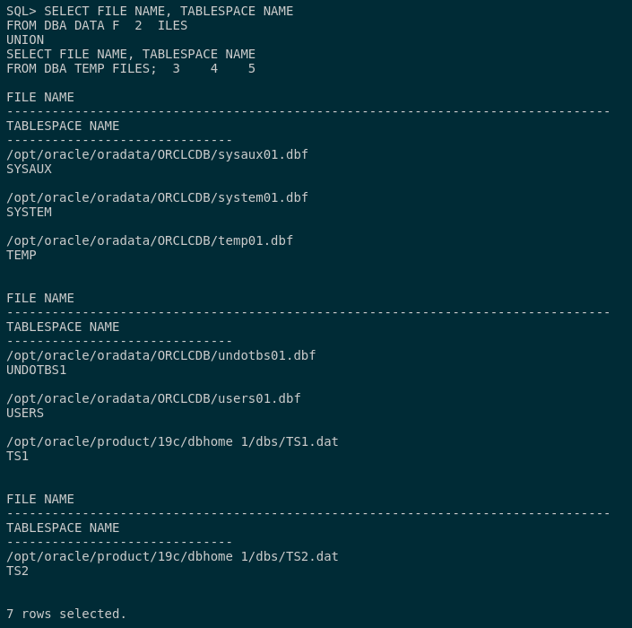
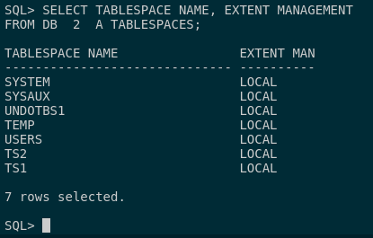

## 1. Muestra los espacios de tablas existentes en tu base de datos y la ruta de los ficheros que los componen. ¿Están las extensiones gestionadas localmente o por diccionario?

Para poder ver los ficheros de datos y ficheros temporales que componen los tablas spaces tenemos que ejecutar la siguiente consulta:

```
SELECT FILE_NAME, TABLESPACE_NAME 
FROM DBA_DATA_FILES 
UNION 
SELECT FILE_NAME, TABLESPACE_NAME 
FROM DBA_TEMP_FILES;
```




Para poder visualizar de que tipo son las extensiones de cada tablaspace con la siguiente consulta:

```
SELECT TABLESPACE_NAME, EXTENT_MANAGEMENT 
FROM DBA_TABLESPACES;
```



Como podemos ver en la devolución de la consulta, en mi base de datos, las extensiones son gestionadas localmente. Podemos ver algunas tablaspaces que reconocemos de prácticas anteriores como SYSTEM y USERS.