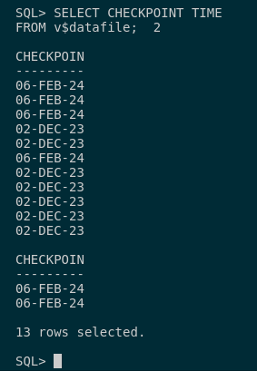
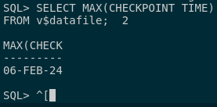

## 2. Usa la vista del diccionario de datos v$datafile para mirar cuando fue la última vez que se ejecutó el proceso CKPT en tu base de datos.

Primero, tenemos que entender que es el proceso CKPT. Este proceso se ejecuta cuando se realiza una marca o punto de control (checkpoint) en nuestra base de datos. 
Este realiza una función de commit cuando se realiza un backup o copia de seguridad sobre nuestra base de datos.

Para ver todos estos checkpoints, deberemos ejecutar la siguiente consulta:

```sql
SELECT CHECKPOINT_TIME 
FROM v$datafile;
```



Si queremos filtar por la última vez que es ejecutó ese proceso, tendremos que agregarle el operando MAX() para ello.

```sql
SELECT MAX(CHECKPOINT_TIME) 
FROM v$datafile;
```

