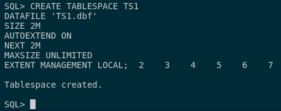
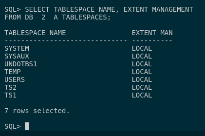
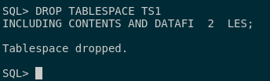
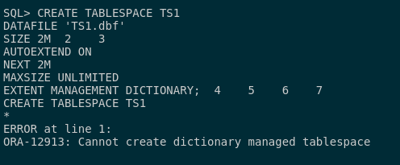

## 3. Intenta crear el tablespace TS1 con un fichero de 2M en tu disco que crezca automáticamente cuando sea necesario. ¿Puedes hacer que la gestión de extensiones sea por diccionario? Averigua la razón.

Para poder crear un tablespace TS1 con un fichero de 2M de nuestro disco que crezca automáticamente cuando sea necesario, tendremos que ejecutar este comando de creación para este mismo:

```sql
CREATE TABLESPACE TS1 
DATAFILE 'TS1.dbf' 
SIZE 2M 
AUTOEXTEND ON 
NEXT 2M 
MAXSIZE UNLIMITED 
EXTENT MANAGEMENT LOCAL;
```



Para ver que se ha creado correctamente, realizamos la consulta del ejercicio 1 para ver que se ha creado correctamente:

```sql
SELECT TABLESPACE_NAME, EXTENT_MANAGEMENT 
FROM DBA_TABLESPACES;
```



En mi caso como queremos saber si podemos hacer que la gestión de extensiones sea por diccionario en vez de gestionarlo de manera local, lo que haríamos sería eliminar el tablespace anterior y lo volvemos a crear agregando a la directiva de EXTEND MANAGEMENT el atributo **DICTIONARY**.

Por ello, borramos todo lo refente a la tablespace:

```sql
DROP TABLESPACE TS1 
INCLUDING CONTENTS AND DATAFILES;
```



Y creamos el nuevo tablespace:

```sql
CREATE TABLESPACE TS1 
DATAFILE 'TS1.dbf' 
SIZE 2M 
AUTOEXTEND ON 
NEXT 2M 
MAXSIZE UNLIMITED 
EXTENT MANAGEMENT DICTIONARY;
```



Lo que nos sucede que al instalar Oracle, se configuró para gestionar las extensiones de manera local. Por ello, no es posible modificarlo para que la gestión de extensiones sea mediante el diccionario, dado que el tablespace SYSTEM se creó originalmente con la configuración de gestión local de extensiones, y todos los tablespaces subsiguientes heredarán esta configuración. 
Lo que nos lleva a que si creamos la TS1 con extensión automática, se nos configurará por defecto para hacerlo de manera local. 