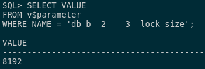
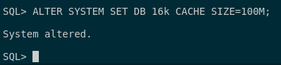
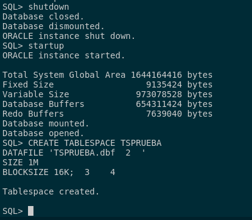
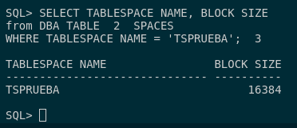
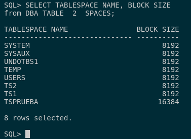

## 4. Averigua el tamaño de un bloque de datos en tu base de datos. Cámbialo al doble del valor que tenga.

Para poder averiguar el tamaño de un bloque de datos en mi base de datos, tendremos que ejecutar la siguiente consulta:

```
SELECT VALUE 
FROM v$parameter 
WHERE NAME = 'db_block_size';
```



Con esto, sabemos cuanto ocupa el tamaño de bloque de datos en mi base de datos es de 8192B o 8K.

El principal inconveniente que no es posible darle el valor doble que tenga al tamaño del bloque en Oracle así que tendremos que crear uno. 
Para ello, tendremos que modificar en el sistenma el nuevo tamaño de bloque:

```
ALTER SYSTEM SET DB_16k_CACHE_SIZE=100M;
```



Después reiniciamos la base de datos para que se cargue la variable que hemos redefinido y creamos este nuevo tablespace.

```
CREATE TABLESPACE TSPRUEBA 
DATAFILE 'TSPRUEBA.dbf' 
SIZE 1M 
BLOCKSIZE 16K;
```



Para comprobar que el tamaño de bloque ha sido modificado correctamente, vamos a realizar la siguiente consulta:

```
SELECT TABLESPACE_NAME, BLOCK_SIZE 
from DBA_TABLESPACES 
WHERE TABLESPACE_NAME = 'TSPRUEBA';
```



Podemos ver que es distinto a los demás tablespaces ejecutando la misma consulta pero sin la clausura **WHERE**:

```
SELECT TABLESPACE_NAME, BLOCK_SIZE 
from DBA_TABLESPACES;
```

