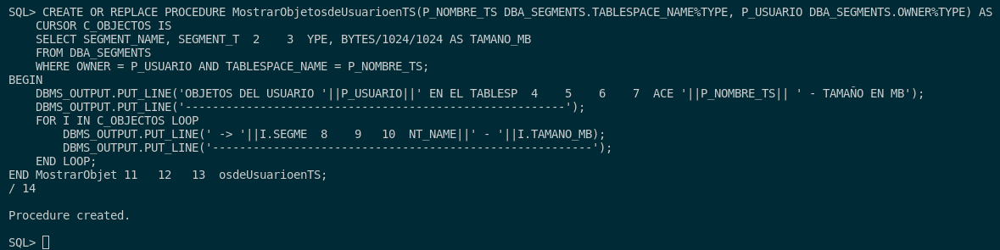
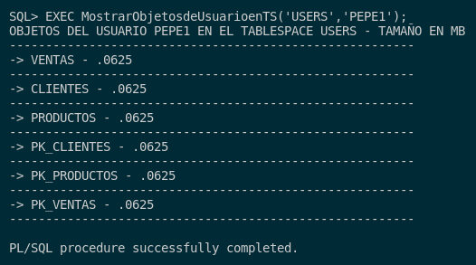

## 5. Realiza un procedimiento MostrarObjetosdeUsuarioenTS que reciba el nombre de un tablespace y el de un usuario y muestre qué objetos tiene el usuario en dicho tablespace y qué tamaño tiene cada uno de ellos.

Tendremos que saber cuales son los objetos de un usuario en dicho tablespace y el tamaño de estos mismos. Para ello, podemos ver que todo lo que necesitamos esta en la tabla **DBA_SEGMENTS**.
En ella mimma,  ubicamos campos como **SEGMENT_NAME** y **BYTES** que son el nombre de esos objetos de este mismo tablespaces y el tamaño de esos mismos.

Con esto, dicho comenzamos la consulta:

```sql
CREATE OR REPLACE PROCEDURE MostrarObjetosdeUsuarioenTS(P_NOMBRE_TS DBA_SEGMENTS.TABLESPACE_NAME%TYPE, P_USUARIO DBA_SEGMENTS.OWNER%TYPE) AS
    CURSOR C_OBJECTOS IS
    SELECT SEGMENT_NAME, SEGMENT_TYPE, BYTES/1024/1024 AS TAMANO_MB
    FROM DBA_SEGMENTS
    WHERE OWNER = P_USUARIO AND TABLESPACE_NAME = P_NOMBRE_TS;
BEGIN
    DBMS_OUTPUT.PUT_LINE('OBJETOS DEL USUARIO '||P_USUARIO||' EN EL TABLESPACE '||P_NOMBRE_TS|| ' - TAMAÑO EN MB');
    DBMS_OUTPUT.PUT_LINE('--------------------------------------------------------');
    FOR I IN C_OBJECTOS LOOP
        DBMS_OUTPUT.PUT_LINE(' -> '||I.SEGMENT_NAME||' - '||I.TAMANO_MB);
        DBMS_OUTPUT.PUT_LINE('--------------------------------------------------------');
    END LOOP;
END MostrarObjetosdeUsuarioenTS;
/
```



Para comprobar que funciona correctamente, como tengo un usuario PEPE1 creado anteriormente y su respectivo tablespace USERS donde tiene creado unas tablas de un proyecto anterior:

```sql
EXEC MostrarObjetosdeUsuarioenTS('USERS','PEPE1');
```

