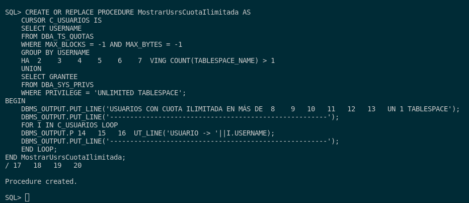
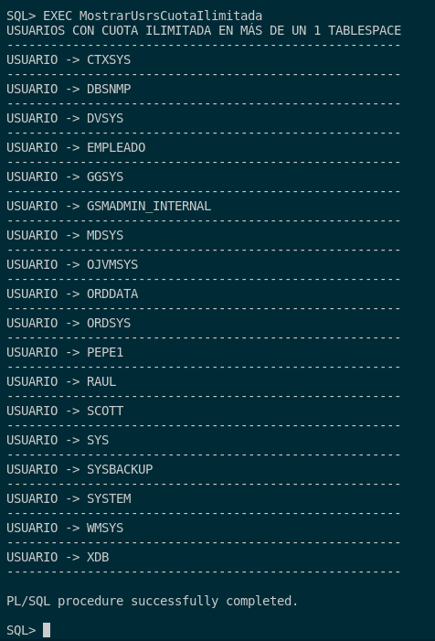

## 6. Realiza un procedimiento llamado MostrarUsrsCuotaIlimitada que muestre los usuarios que puedan escribir de forma ilimitada en más de uno de los tablespaces que cuentan con ficheros en la unidad C:

Para poder realizar este procedimiento que  muestre los usuarios que puedan escribir de forma ilimitada en más de uno de los tablespaces que cuentan con ficheros en la unidad C:, tenemos que saber que necesitamos recorrer y ver los usuarios que tiene un recurso de poder escribir de forma ilimitada en el sistema.

Debemos saber que para el procedimiento, necesitamos saber el tamaño de bloques y bytes de un usuario sobre un tablespace específico (**MAX_BLOCKS** y **MAX_BYTES**). Esto puede ser consultado en la tabla **DBA_TS_QUOTAS**. Además, sabemos que si indicamos ambos valores sean -1 es porque no tienen limites definidos y por ello sus recusos son ilimitados en dicho tablespace. 

Por último, sabemos que para ver los privilegios de DBA que puede tener un usuario, existe en la tabla **DBA_SYS_PRIVS** un privilegio ilimitado que permite la cualquier tipo de modificación sobre cualquier tablespace (y como DBA) puede ser asigando a otros usuarios. Ese privilegio no es más que **UNLIMITED TABLESPACE**.

Para poder construir dicho procedimiento, tenemos que hacer una unión de tanto el privilegio como de la cuota que tienen un usuario sobre un tablespace que debe ser ilimitada.

Con esto dicho, pasamos a la creación del procedimiento:

```
CREATE OR REPLACE PROCEDURE MostrarUsrsCuotaIlimitada AS
    CURSOR C_USUARIOS IS 
    SELECT USERNAME 
    FROM DBA_TS_QUOTAS
    WHERE MAX_BLOCKS = -1 AND MAX_BYTES = -1
    GROUP BY USERNAME
    HAVING COUNT(TABLESPACE_NAME) > 1
    UNION
    SELECT GRANTEE
    FROM DBA_SYS_PRIVS
    WHERE PRIVILEGE = 'UNLIMITED TABLESPACE';
BEGIN
    DBMS_OUTPUT.PUT_LINE('USUARIOS CON CUOTA ILIMITADA EN MÁS DE UN 1 TABLESPACE');
    DBMS_OUTPUT.PUT_LINE('------------------------------------------------------');
    FOR I IN C_USUARIOS LOOP
    DBMS_OUTPUT.PUT_LINE('USUARIO -> '||I.USERNAME);
    DBMS_OUTPUT.PUT_LINE('------------------------------------------------------');
    END LOOP;
END MostrarUsrsCuotaIlimitada;
/
```



Ejecución del procedimiento:

```
EXEC MostrarUsrsCuotaIlimitada
```

