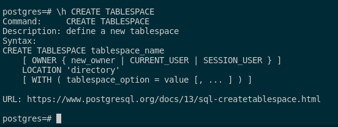

## 7. Averigua si existe el concepto de tablespace en Postgres, en qué consiste y las diferencias con los tablespaces de ORACLE.

En Postgres, también se pueden crear tablespaces que nos permiten organizar y distribuir tus datos a nuestro gusto para poder ubicarlos en diversos directorios.

Esto aporta una mejoría al sistemas de almacenamiento de datos y nos permite tener una mejor escalabilidad y flexibilidad sobre los datos. Esto nos puede servir como por ejemplo, cuando necesitamos acceder a los datos de una unidad de disco duro de manera rápida y eficiente.

Pero tenemos que entender entre PostgreSQL tiene grandes diferencias en cuanto a sintáxis y tipos de tablespace con respecto a Oracle. Para entenderlo mejor, voy a explicar las principales diferencias entre ambos:

### Oracle

En Oracle existen 3 tipos de tablespaces difrentes con su respectiva sintáxis de creación y funcionamiento. Estos son los siguientes:

- **Tablespace permanente**: este tablespaces es un contenedor lógico que en una base de datos desempeña la función de almacenar datos, como por ejemplo tablas, vistas... Estos tablespaces se almacenan filesystem del servidor. Su sintaxis es la siguiente:

```sql
CREATE TABLESPACE nombre_ts
  [ SMALLFILE | BIGFILE ]
  DATAFILE 'nombre_archivo' [ SIZE integer [ K | M | G | T | P | E ] ] [ REUSE ]
    [ AUTOEXTEND { OFF | ON [ NEXT integer [ K | M | G | T | P | E ] ] [ MAXSIZE { UNLIMITED | integer [ K | M | G | T | P | E ] } } ]
    | ('archivo1' [, 'archivo2'] ...) [ SIZE integer [ K | M | G | T | P | E ] ] [ REUSE ]
    ]
  [ MINIMUM EXTENT integer [ K | M | G | T | P | E ] ]
  [ BLOCKSIZE integer [ K ] ]
  [ LOGGING | NOLOGGING ]
  [ FORCE LOGGING ]
  [ DEFAULT { COMPRESS | NOCOMPRESS } ]
  storage_clause
  [ ONLINE | OFFLINE ]
  [ EXTENT MANAGEMENT 
      { LOCAL [ AUTOALLOCATE | UNIFORM [ SIZE integer [ K | M | G | T | P | E ] ] ]
      | DICTIONARY
      }
  ]
  [ SEGMENT SPACE MANAGEMENT { AUTO | MANUAL } ]
  [ FLASHBACK { ON | OFF } ];
```

Con cada una de estas acciones, podemos hacer lo siguiente: 

1. `CREATE TABLESPACE nombre_ts`: Crea un tablespace con un nombre que queramos.

2. `[ SMALLFILE | BIGFILE ]`: Especifica si el tablespace tendrá un tamaño limitado o pequeño o por ende será grande.

3. `DATAFILE 'nombre_archivo' [ SIZE integer [ K | M | G | T | P | E ] ] [ REUSE ]`: Define el archivo de datos que esta asociado a el tablespace que estamos creado, dando el nombre del fichero, su tamaño inicial (en B, KB, MB, GB, etc.) y si ya existe previamente, se reutilizará.

4. `[ AUTOEXTEND { OFF | ON [ NEXT integer [ K | M | G | T | P | E ] ] [ MAXSIZE { UNLIMITED | integer [ K | M | G | T | P | E ] } } ]`: Con esta instrucción podemos modificar si el archivo de datos se extiende automáticamnete, especificando el tamaño que puede crecer (en bytes o unidades) y el tamaño máximo que permite para la extensión.

5. `| ('archivo1' [, 'archivo2'] ...) [ SIZE integer [ K | M | G | T | P | E ] ] [ REUSE ]`: Con esta opción podemos permitir que use varios archivos de datos para dicho tablespace, cada uno con su propio tamaño y opción de reutilización que hemos comentado anteriormente.

6. `[ MINIMUM EXTENT integer [ K | M | G | T | P | E ] ]`: Establece el tamaño mínimo de la extensión para el tablespace.

7. `[ BLOCKSIZE integer [ K ] ]`: Define el tamaño del bloque para el tablespace.

8. `[ LOGGING | NOLOGGING ]`: Podemos poner que las operaciones realizadas sean con un logeo o no en el tablespace mediante el archivo redo.

9. `[ FORCE LOGGING ]`: Obliga a que todas las operaciones en el tablespace se registren en el archivo de registro de redo.

10. `[ DEFAULT { COMPRESS | NOCOMPRESS } ]`: Podemos establecer la compresión predeterminada para los segmentos del tablespace.

11. `storage_clause`: Define la cláusula de almacenamiento para el tablespace, como los parámetros de almacenamiento específicos que hemos comentado.

12. `[ ONLINE | OFFLINE ]`: Indica si el tablespace estará disponible o no disponible para su uso.

13. `[ EXTENT MANAGEMENT { LOCAL [ AUTOALLOCATE | UNIFORM [ SIZE integer [ K | M | G | T | P | E ] ] ] | DICTIONARY } ]`: Gestionamos la organización de extensiones para el tablespace, especificando si se asignarán automáticamente, uniformemente o utilizando un diccionario.

14. `[ SEGMENT SPACE MANAGEMENT { AUTO | MANUAL } ]`: Gestiona el espacio de segmento para el tablespace, pudiendo ser automática o manual.

15. `[ FLASHBACK { ON | OFF } ]`: Habilita o deshabilita la capacidad de flashback para el tablespace, lo que permite realizar operaciones de recuperación a un checkpoint en el tiempo.


**Nota: El archivo de registro de redo en Oracle, almacena un registro secuencial de todas las operaciones realizadas en la base de datos por si sucede algún imprevisto o error en la base de datos. Es fundamental para mantener la integridad y la consistencia de los datos, ya que facilita la recuperación de la base de datos a un estado anterior.**


- **Tablespace temporal**: este tablespace temporal es un contenedor lógico que en una base de datos desempeña la función de almacenar datos temporales, por ejemplo como los datos que se crean durante una instrucción SQL. Estos datos se almacenan en filesystem del propio servidor. Su sintaxis es la siguiente:


```sql
CREATE TEMPORARY TABLESPACE nombre_ts
  [ SMALLFILE | BIGFILE ]
  [ TEMPFILE { [ 'nombre_archivo' | 'ASM_nombre_archivo' ]
               [ SIZE integer [ K | M | G | T | P | E ] ]
               [ REUSE ]
               [ AUTOEXTEND
                   { OFF
                   | ON [ NEXT integer [ K | M | G | T | P | E ] ]
                   [ MAXSIZE { UNLIMITED | integer [ K | M | G | T | P | E ] } ]
                   }
               ]
             | [ 'nombre_archivo | ASM_nombre_archivo'
             | ('nombre_archivo | ASM_nombre_archivo'
                 [, 'nombre_archivo | ASM_nombre_archivo' ] )
             ]
             [ SIZE integer [ K | M | G | T | P | E ] ]
             [ REUSE ]
           }
  [ TABLESPACE GROUP { nombre_grupo_ts | '' } ]
  [ EXTENT MANAGEMENT
       { LOCAL
          [ AUTOALLOCATE | UNIFORM [ SIZE integer [ K | M | G | T | P | E ] ] ]
       | DICTIONARY
       } ]]
```

Con respecto a las acciones, son iguales que las que he comentado en el tablespace permanente lo que pasa que hay cosas que el tablespace temporal no tiene. 

Lo único a destacar es lo siguiente:

1. `[ TABLESPACE GROUP { tablespace_group_name | '' } ]`: Esta parte de la sintaxis nos puede ser muy útil, ya que nos permite asociar el tablespace temporal a un grupo de tablespaces temporales. Los grupos de tablespaces temporales se utilizan para distribuir la carga de trabajo de las operaciones temporales entre múltiples tablespaces.


- **Tablespace undo**:  este tablespace undo es un contenedor lógico que en una base de datos desempeña la función de almacenar información necesaria para restaurar los datos en un estado anterior si hay algún error o fallo en ella (así como un checkpoint). Su sintaxis es la siguiente:

```sql
CREATE UNDO TABLESPACE nombre_ts
    [ SMALLFILE | BIGFILE ]
    [ DATAFILE { 
                  [ 'nombre_archivo' | 'ASM_nombre_archivo' ]
                  [ SIZE integer [ K | M | G | T | P | E ] ]
                  [ REUSE ]
                  [ AUTOEXTEND
                      { 
                        OFF
                        | ON [ NEXT integer [ K | M | G | T | P | E ] ]
                          [ MAXSIZE { UNLIMITED | integer [ K | M | G | T | P | E ] } ]
                      }
                 ]
              | [ 'nombre_archivo | ASM_nombre_archivo'
                | ('nombre_archivo | ASM_nombre_archivo'
                   [, 'nombre_archivo | ASM_nombre_archivo' ] )
                ]
                [ SIZE integer [ K | M | G | T | P | E ] ]
                [ REUSE ]
              }
    [ EXTENT MANAGEMENT
       { 
          LOCAL
          [ AUTOALLOCATE | UNIFORM [ SIZE integer [ K | M | G | T | P | E ] ] ]
        | DICTIONARY
       } 
    ]
    [ RETENTION { GUARANTEE | NOGUARANTEE } ]]
```

Con respecto a las acciones, son iguales que las que he comentado en el tablespace permanente lo que pasa que hay cosas que el tablespace undo no tiene. 

Lo único a destacar es lo siguiente:

1. `[ RETENTION { GUARANTEE | NOGUARANTEE } ]`: este acción controla si se garantiza la retención de datos de "undo" o no. Con **GUARANTEE** nos aseguramos que los datos de "undo" estén disponibles para transacciones de largo plazo, mientras que con NOGUARANTEE nos permite que los datos de "undo" se eliminen si es necesario para liberar espacio libre.


Con respecto a la sintáxis de un tablespace en PostgreSQL, se ve con el siguiente comando:

```sql
\h CREATE TABLESPACE
```

Este nos devuelve lo siguiente:

```sql
Command:     CREATE TABLESPACE
Description: define a new tablespace
Syntax:
CREATE TABLESPACE nombre_ts
    [ OWNER { nuevo_propietario | CURRENT_USER | SESSION_USER } ]
    LOCATION 'directorio_datos'
    [ WITH ( tablespace_option = value [, ... ] ) ]
```




Con cada una de estas acciones, podemos hacer lo siguiente:

1. `CREATE TABLESPACE nombre_ts`: Especifica el nombre del tablespace que se está creando.

2. `OWNER { nuevo_propietario | CURRENT_USER | SESSION_USER }`: Opcionalmente, podemos especificar el propietario del tablespace, que puede ser un nuevo propietario, el usuario actual o el usuario de la sesión.

3. `LOCATION 'directorio_datos'`: Especifica la ubicación física del tablespace en el sistema de archivos del servidor de la base de datos.

4. `[ WITH ( tablespace_option = value [, ... ] ) ]`: Opcionalmente, nos da opciones adicionales para el tablespace, como el tamaño inicial, el tamaño máximo, la autoextensión, etc.


Con esto comentado, pasamos a las diferencias entre ambos gestores.

### Diferencias entres Oracle y PostgreSQL

- En Oracle, el almacenamiento de datos se organiza en **tablespaces**, que son como contenedores para los archivos de datos llamados **datafiles**. Estos **datafiles** son donde realmente se almacenan los datos en disco. En Postgres es distinto porque guardamos nuestros datos en **carpetas en el sistema de archivos** del servidor.

- En Oracle, los **tablespaces** nos dan un control más exhaustivo y flexibilidad en la gestión del almacenamiento. Por ello, crear **tablespaces** específicos para diferentes tipos de datos y ajustar su tamaño y configuración según nuestras necesidades. Sin embargo, en Postgres, la gestión del almacenamiento es más simplificada ya que no tenemos la capacidad de control del espacio como en Oracle. Esto nos limita ya que **no podemos definir límites en el tamaño de las carpetas** que usamos para almacenar datos.

- En Oracle, los **tablespaces** pueden tener una gran cantidad de objetos de base de datos, como tablas, índices, vistas, procedimientos almacenados, entre otros. Estos objetos se pueden distribuir en diferentes **tablespaces** según criterios de rendimiento o administrativos. En cambio, en Postgres, aunque también podemos usar **tablespaces**, estos no se utilizan para almacenar tablas. En su lugar, las tablas y otros objetos se almacenan directamente en el **directorio de datos** de Postgres, y los **tablespaces** se utilizan principalmente para organizar otros tipos de objetos relacionados con la base de datos, como índices y vistas.

- En Oracle, también tenemos la posibilidad de colocar nuestros **tablespaces** en dispositivos de almacenamiento externos, como discos **SAS** o **Fibre Channel**. Esto puede ser útil para la gestión de almacenamiento en entornos de grandes bases de datos o donde se requiera un alto rendimiento. Sin embargo, en Postgres, **esta capacidad no está disponible**, ya que los datos se almacenan directamente en el sistema de archivos del servidor sin la posibilidad de acceder a discos externos de manera directa.