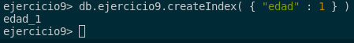
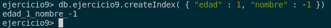
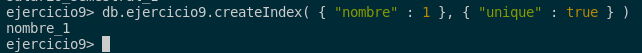
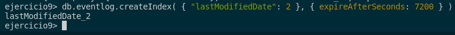

## 9. Averigua si existe el concepto de índice en MongoDB y las diferencias con los índices de ORACLE. Explica los distintos tipos de índice que ofrece MongoDB.

En MongoDB existen varias opciones para trabajar con índices, dependiendo de cómo deseemos que se comporten, como si queremos aplicarlos a uno o más campos, si queremos que el orden sea ascendente o descendente, etc. Por otro lado, con Oracle contamos con diferentes tipos de índices y opciones.

Por ello, vamos a ver los tipos de índices en cada MongoDB y Oracle respectivamente.

### Tipos de índices en MongoDB:

- **Simples**: los criterios de ordenación en MongoDB, s aplican a una sola categoría específica. Se utiliza el valor 1 para indicar orden ascendente y -1 para orden descendente. Un ejemplo, puede ser ordenara por edad de manera ascendente:

```sql
db.ejercicio9.createIndex( { "edad" : 1 } )
```



- **Compound**: los operadores lógicos se utilizan para trabajar con dos o más valores, teniendo un comportamiento similar al de los operadores simples. Esto permite especificar la dirección de búsqueda para cada campo. Un ejemplo puede ser el anterior y ordenar por nombre de manera descendente:

```sql
db.ejercicio9.createIndex( { "edad" : 1, "nombre" : -1 })
```



- **Multikey**: los índices multikey se utilizan para indexar contenido almacenado en arrays. Esto permite que MongoDB solo recorra aquellos documentos cuyos arrays contienen uno de los valores especificados. Un ejemplo puede ser el ordenador semestre de manera ascendente:

```sql
db.ejercicio9.createIndex( { "salario_semestral" : 1 } )
```


- **Unique**: los índices únicos se emplean para remover los campos que se repiten, algo similar a cuando realizamos una select distinct en Oracle. Un ejemplo es ordenar de manera ascendente y eliminar los campos que se repitan:

```sql
db.ejercicio9.createIndex( { "nombre" : 1 }, { "unique" : true } )
```



- **TTL Indexes**: este índice no funciona como los anteriores que hemos comentado, ya que estamos especificando el tiempo de caducidad de un documento basado en un campo de éste. La documentación de MongoDB muestra cómo los documentos en la colección eventlog se borrarían si no se modificasen durante una hora. Un ejemplo puede ser crear un índice TTL en una colección de registros de eventos, donde los documentos se eliminarán automáticamente después de 2 horas si no han sido modificados.

```sql
db.eventlog.createIndex( { "lastModifiedDate": 2 }, { expireAfterSeconds: 7200 } )
```




Para hacer las pruebas que hecho yo en MongoDB, os dejo los comandos para acceder a la base de datos y los inserts del fichero bson :).

```sql
use ejercicio9

db.createCollection("ejercicio9")

db.ejercicio9.insertMany([
    {
        "nombre": "María García",
        "edad": 28,
        "salario_semestral": [
            {"semestre": "Primer semestre", "pago": 30000},
            {"semestre": "Segundo semestre", "pago": 30000}
        ],
        "correo_electronico": "maria@gmail.com"
    },
    {
        "nombre": "Pedro López",
        "edad": 35,
        "salario_semestral": [
            {"semestre": "Primer semestre", "pago": 35000},
            {"semestre": "Segundo semestre", "pago": 35000}
        ],
        "correo_electronico": "pedro@hotmail.com"
    },
    {
        "nombre": "Laura Martínez",
        "edad": 25,
        "salario_semestral": [
            {"semestre": "Primer semestre", "pago": 27500},
            {"semestre": "Segundo semestre", "pago": 27500}
        ],
        "correo_electronico": "laura@gmail.com"
    },
    {
        "nombre": "Carlos Rodríguez",
        "edad": 40,
        "salario_semestral": [
            {"semestre": "Primer semestre", "pago": 40000},
            {"semestre": "Segundo semestre", "pago": 40000}
        ],
        "correo_electronico": "carlos@yahoo.com"
    },
    {
        "nombre": "Ana Sánchez",
        "edad": 32,
        "salario_semestral": [
            {"semestre": "Primer semestre", "pago": 32500},
            {"semestre": "Segundo semestre", "pago": 32500}
        ],
        "correo_electronico": "ana@gmail.com"
    }
])
```

Con los índices en MongoDB ya vistos, pasamos a ver los índices en Oracle.

### Tipos de índices en Oracle:

En Oracle existen 3 tipos de índices que son los siguientes:

- **Table Index**: Este tipo de índice se utiliza para mejorar el rendimiento de las consultas al permitir un acceso más rápido a los datos en una tabla específica. La sintaxis es la siguiente: 

```sql
CREATE [UNIQUE|BITMAP] INDEX [schema.]index_name
ON [schema.]table_name [tbl_alias]
   (column [ASC | DESC]) index_clause index_attributes
```

Las acciones que realiza este índice son las siguientes:

1. `UNIQUE|BITMAP`: Esto indica si el índice será único o bitmap. Un índice único nos garantiza que no haya duplicados en el índice, mientras que un índice bitmap es útil para columnas con un número limitado de valores distintos.

2. `[schema.]index_name`: Especifica el nombre del índice que se está creando.

3. `ON [schema.]table_name [tbl_alias]`: Indica la tabla en la que se va a crear el índice. También se puede poner un alias.

4. `(column [ASC | DESC])`: Especifica la columna o columnas que se indexarán en orden ascendente (ASC) o descendente (DESC). Para poner más de una columna, se separan con comas.

5. `index_clause`: Esta parte de la sentencia puede tener condiciones el índice, como `TABLESPACE`, `STORAGE`, etc.

6. `index_attributes`: Aquí se puede añadir atributos para el índice, como `COMPRESSION`, `PARALLEL`, `VISIBLE`, etc.


- **Cluster Index**: Este tipo de índice se utiliza para mejorar el rendimiento de las consultas al agrupar físicamente las filas de una tabla en función de los valores de una o más columnas. La sintaxis es la siguiente:

```sql
CREATE [UNIQUE|BITMAP] INDEX [schema.]index_name
ON CLUSTER [schema.]cluster_name index_attribs
```

Las acciones que realiza este índice son iguales que el anterior pero algunas que valen para este. Lo diferente con respecto al anterior, es lo siguiente:

1. `ON CLUSTER [schema.]cluster_name`: Indica el nombre del clúster en el que se va a crear el índice. Un clúster es una estructura de datos que almacena físicamente las filas de la tabla dependiendo de los valores de una o más columnas.


- **Bitmap Join Index**: Este tipo de índice se utiliza para mejorar el rendimiento de las consultas que involucran operaciones de unión (join) entre tablas. La sintaxis es la siguiente:

```sql
CREATE [UNIQUE|BITMAP] INDEX [schema.]index_name
ON [schema.]table_name [tbl_alias]
   (col_expression [ASC | DESC])
   FROM [schema.]table_name [tbl_alias]
   WHERE condition [index_clause] index_attribs
```

Las acciones que realiza este índice son iguales al primero, la diferencia que se le añade las siguientes acciones: 

5. `FROM [schema.]table_name [tbl_alias]`: Indica la tabla desde la cual se sacaremos los datos para crear el índice.

6. `WHERE condition`: Especifica la condición que nos permite elegir qué filas se incluirán en el índice.


En los índices **Table Index** y **Bitmap Join Index**, tenemos una acción que nos permiter elegir 
las **index_clauses**. Los **index_clauses** son los siguientes:

1. `LOCAL STORE IN (tablespace)`: Especifica dónde se almacenarán los datos del índice localmente, en el tablespace concreto.

2. `LOCAL (PARTITION ...)`: Indica que el índice será local y se creará en cada partición de la tabla, específicando sus respectivas opciones.

3. `GLOBAL PARTITION BY RANGE (col_list) ...`: Crea un índice global particionado por rango dependiendo de la lista de columnas . Este acción se dividirán los datos en el índice en múltiples particiones, cada una definida por un rango de valores.

4. `INDEXTYPE IS indextype [PARALLEL int|NOPARALLEL] [PARAMETERS ('ODCI_Params')]`: Especifica el tipo de índice y sus parámetros extra. Tenemos que tener en cuenta que esto es solo para **Table Index**, no para **Bitmap Join Index**. 

La sintaxis de cada uno es la siguiente:

```sql
LOCAL STORE IN (tablespace)

LOCAL STORE IN (tablespace)
  (PARTITION [partition
       [LOGGING|NOLOGGING]
       [TABLESPACE {tablespace|DEFAULT}]
       [PCTFREE int]
       [PCTUSED int]
       [INITRANS int]
       [MAXTRANS int]
       [STORAGE storage_clause]
       [STORE IN {tablespace_name|DEFAULT]
       [SUBPARTITION [subpartition [TABLESPACE tablespace]]]])

LOCAL (PARTITION [partition
       [LOGGING|NOLOGGING]
       [TABLESPACE {tablespace|DEFAULT}]
       [PCTFREE int]
       [PCTUSED int]
       [INITRANS int]
       [MAXTRANS int]
       [STORAGE storage_clause]
       [STORE IN {tablespace_name|DEFAULT]
       [SUBPARTITION [subpartition [TABLESPACE tablespace]]]])

GLOBAL PARTITION BY RANGE (col_list)
   ( PARTITION partition VALUES LESS THAN (value_list)
       [LOGGING|NOLOGGING]
       [TABLESPACE {tablespace|DEFAULT}]
       [PCTFREE int]
       [PCTUSED int]
       [INITRANS int]
       [MAXTRANS int]
       [STORAGE storage_clause] )

INDEXTYPE IS indextype [PARALLEL int|NOPARALLEL] [PARAMETERS ('ODCI_Params')]
```

Por último, además **index_attribs** puede ser cualquier combinación de los índices anteriores. La sintaxis es la siguiente:

```sql
NOSORT|SORT
REVERSE
COMPRESS int
NOCOMPRESS
COMPUTE STATISTICS
[NO]LOGGING
ONLINE
TABLESPACE {tablespace|DEFAULT}
PCTFREE int
PCTUSED int
INITRANS int
MAXTRANS int
STORAGE storage_clause
PARALLEL parallel_clause
```

Cada uno de estos **index_attribs**, hace lo siguiente:

1. `NOSORT|SORT`: Con este atributo podemos elegir si los datos se ordenarán antes de la creación del índice.

2. `REVERSE`: Indica que los datos se añadirán al índice en orden inverso.

3. `COMPRESS int`: Comprime los datos del índice.

4. `NOCOMPRESS`: Quita la compresión de datos del índice.

5. `COMPUTE STATISTICS`: Calcula estadísticas sobre el índice.

6. `[NO]LOGGING`: Controla el registro y la actividad del índice.

7. `ONLINE`: Nos deja crear el índice mientras la tabla está en uso.

8. `TABLESPACE {tablespace|DEFAULT}`: Define el tablespace para el índice.

9. `PCTFREE int`: Establece el porcentaje de espacio libre en los bloques de datos.

10. `PCTUSED int`: Define el porcentaje mínimo de espacio utilizado en los bloques de datos.

11. `INITRANS int`: Establece el número inicial de entradas de transacción.

12. `MAXTRANS int`: Establece el número máximo de entradas de transacción.

13. `STORAGE storage_clause`: Define las características de almacenamiento del índice.

14. `PARALLEL parallel_clause`: Especifica el grado de paralelismo para la creación del índice.


Con esto explicado, pasamos a la diferencias entre ellos.

### Las diferencias entre MongoDB y Oracle:

Podemos ver que con lo que hemos explicado y sabiendo que Oracle al ser un sistema de datos relacional y MongoDB un sistema de datos no relacional, podemos ver difrencias entre ellos.

- La primera diferencia es que en Oracle se crean utilizando sentencias SQL, mientras que en MongoDB se crean usando comandos Javascript (en formato BSON).

Seguido de esto vamos a enumerar las diferencias entre ellos para los índices:

1. `Índices Bitmap`:

- En Oracle se admiten índices bitmap, que mejoran el rendimiento de las consultas al almacenar información de manera efectiva.
- En MongoDB no se admiten índices bitmap.

2. `Índices Espaciales`:

- En Oracle se admite índices espaciales para la administración de datos geoespaciales.
- En MongoDB no se admite índices espaciales, pero hay APIs que te permiten hacerlo.

3. `Almacenamiento de Índices`:

- En Oracle, los índices se almacenan en la memoria principal (RAM).
- En MongoDB, los índices se almacenan en la memoria secundaria (disco duro).

4. `Índices Funcionales`:

- En Oracle se admiten índices funcionales, construidos a partir de funciones o expresiones.
- En MongoDB no se admiten índices funcionales.

5. `Creación de Índices`:

- En Oracle, los índices se crean en tiempo de compilación, antes de ejecutar la consulta.
- En MongoDB, los índices se crean en tiempo de ejecución, cuando se ejecuta una consulta o se actualizan los datos.

6. `Índices en Columnas Virtuales`:

- En Oracle se permite la creación de índices en columnas virtuales, mejorando el rendimiento de la consulta.
- En MongoDB no se permite la creación de índices en columnas virtuales.