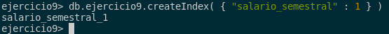

## 9. Averigua si existe el concepto de índice en MongoDB y las diferencias con los índices de ORACLE. Explica los distintos tipos de índice que ofrece MongoDB.

En MongoDB existen varias opciones para trabajar con índices, dependiendo de cómo deseemos que se comporten, como si queremos aplicarlos a uno o más campos, si queremos que el orden sea ascendente o descendente, etc. Por otro lado, con Oracle contamos con diferentes tipos de índices y opciones.

Por ello, vamos a ver los tipos de índices en cada MongoDB y Oracle respectivamente.

### Tipos de índices en MongoDB:

- **Simples**: los criterios de ordenación en MongoDB, s aplican a una sola categoría específica. Se utiliza el valor 1 para indicar orden ascendente y -1 para orden descendente. Un ejemplo, puede ser ordenara por edad de manera ascendente:

```sql
db.ejercicio9.createIndex( { "edad" : 1 } )
```


- **Compound**: los operadores lógicos se utilizan para trabajar con dos o más valores, teniendo un comportamiento similar al de los operadores simples. Esto permite especificar la dirección de búsqueda para cada campo. Un ejemplo puede ser el anterior y ordenar por nombre de manera descendente:

```sql
db.ejercicio9.createIndex( { "edad" : 1, "nombre" : -1 })
```


- **Multikey**: los índices multikey se utilizan para indexar contenido almacenado en arrays. Esto permite que MongoDB solo recorra aquellos documentos cuyos arrays contienen uno de los valores especificados. Un ejemplo puede ser el ordenador semestre de manera ascendente:

```sql
db.ejercicio9.createIndex( { "salario_semestral" : 1 } )
```



- **Unique**: los índices únicos se emplean para remover los campos que se repiten, algo similar a cuando realizamos una select distinct en Oracle. Un ejemplo es ordenar de manera ascendente y eliminar los campos que se repitan:

```sql
db.ejercicio9.createIndex( { "nombre" : 1 }, { "unique" : true } )
```


- **TTL Indexes**: este índice no funciona como los anteriores que hemos comentado, ya que estamos especificando el tiempo de caducidad de un documento basado en un campo de éste. La documentación de MongoDB muestra cómo los documentos en la colección eventlog se borrarían si no se modificasen durante una hora. Un ejemplo puede ser crear un índice TTL en una colección de registros de eventos, donde los documentos se eliminarán automáticamente después de 2 horas si no han sido modificados.

```sql
db.eventlog.createIndex( { "lastModifiedDate": 2 }, { expireAfterSeconds: 7200 } )
```


Para hacer las pruebas que hecho yo en MongoDB, os dejo los comandos para acceder a la base de datos y los inserts del fichero bson :).

```sql
use ejercicio9

db.createCollection("ejercicio9")

db.ejercicio9.insertMany([
    {
        "nombre": "María García",
        "edad": 28,
        "salario_semestral": [
            {"semestre": "Primer semestre", "pago": 30000},
            {"semestre": "Segundo semestre", "pago": 30000}
        ],
        "correo_electronico": "maria@gmail.com"
    },
    {
        "nombre": "Pedro López",
        "edad": 35,
        "salario_semestral": [
            {"semestre": "Primer semestre", "pago": 35000},
            {"semestre": "Segundo semestre", "pago": 35000}
        ],
        "correo_electronico": "pedro@hotmail.com"
    },
    {
        "nombre": "Laura Martínez",
        "edad": 25,
        "salario_semestral": [
            {"semestre": "Primer semestre", "pago": 27500},
            {"semestre": "Segundo semestre", "pago": 27500}
        ],
        "correo_electronico": "laura@gmail.com"
    },
    {
        "nombre": "Carlos Rodríguez",
        "edad": 40,
        "salario_semestral": [
            {"semestre": "Primer semestre", "pago": 40000},
            {"semestre": "Segundo semestre", "pago": 40000}
        ],
        "correo_electronico": "carlos@yahoo.com"
    },
    {
        "nombre": "Ana Sánchez",
        "edad": 32,
        "salario_semestral": [
            {"semestre": "Primer semestre", "pago": 32500},
            {"semestre": "Segundo semestre", "pago": 32500}
        ],
        "correo_electronico": "ana@gmail.com"
    }
])
```

Con los índices en MongoDB ya vistos, pasamos a ver los índices en Oracle.

### Tipos de índices en Oracle:

En Oracle existen 3 tipos de índices que son los siguientes:

- **Table Index**: Este tipo de índice se utiliza para mejorar el rendimiento de las consultas al permitir un acceso más rápido a los datos en una tabla específica. La sintaxis es la siguiente: 

```sql
CREATE [UNIQUE|BITMAP] INDEX [schema.]index_name
ON [schema.]table_name [tbl_alias]
   (column [ASC | DESC]) index_clause index_attributes
```

- **Cluster Index**:

- **Bitmap Join Index**:
