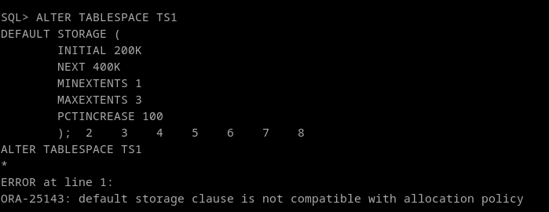
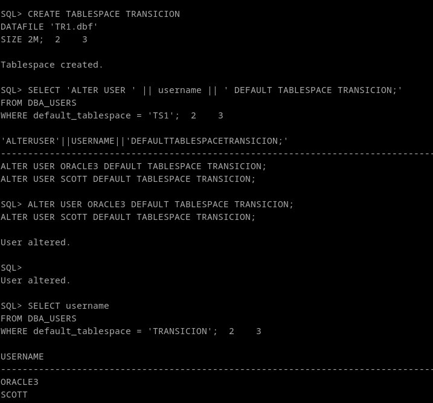
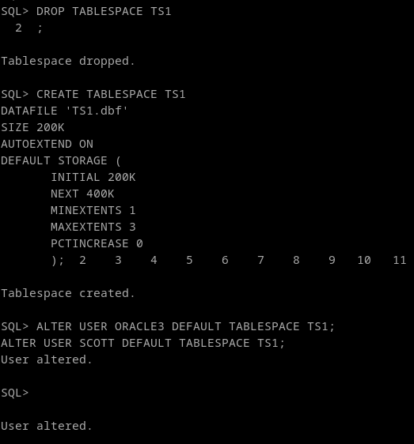

## 1. Establece que los objetos que se creen en el TS1 (creado por Alumno 1) tengan un tamaño inicial de 200K, y que cada extensión sea del doble del tamaño que la anterior. El número máximo de extensiones debe ser de 3.


Normalmente, Con un alter tablespace lograríamos el efecto deseado, pero al intentarlo nos da el error ORA-25143, ya que al crearla sin la opción "default storage" se crea con la política "UNIFORM" Previniendo el cambio.
```
ALTER TABLESPACE TS1
DEFAULT STORAGE (
        INITIAL 200K
        NEXT 400K
        MINEXTENTS 1
        MAXEXTENTS 3
        PCTINCREASE 100
        );
```



Para solucionarlo, lo que haremos será mover a los usuarios asociados a ese tablespace a otro tablespace, y despues borraremos y lo crearemos de nuevo con la política que queremos. Esto es en pos de mantener las transacciones funcionando mientras hacemos el cambio. 

```
CREATE TABLESPACE TRANSICION
DATAFILE 'TR1.dbf'
SIZE 2M;

SELECT 'ALTER USER ' || username || ' DEFAULT TABLESPACE TRANSICION;'
FROM DBA_USERS
WHERE default_tablespace = 'TS1';
```




```
DROP TABLESPACE TS1

CREATE TABLESPACE TS1 
DATAFILE 'TS1.dbf' 
SIZE 200K 
AUTOEXTEND ON 
DEFAULT STORAGE (
       INITIAL 200K
       NEXT 400K
       MINEXTENTS 1
       MAXEXTENTS 3
       PCTINCREASE 0
       );

```




NOTA: para saber la localización del datafile en el sistema de ficheros, y así poder crear el nuevo tablespace con el mismo nombre, he usado esta consulta:
```
SELECT file_name
FROM DBA_DATA_FILES
WHERE tablespace_name = 'TS1'
```