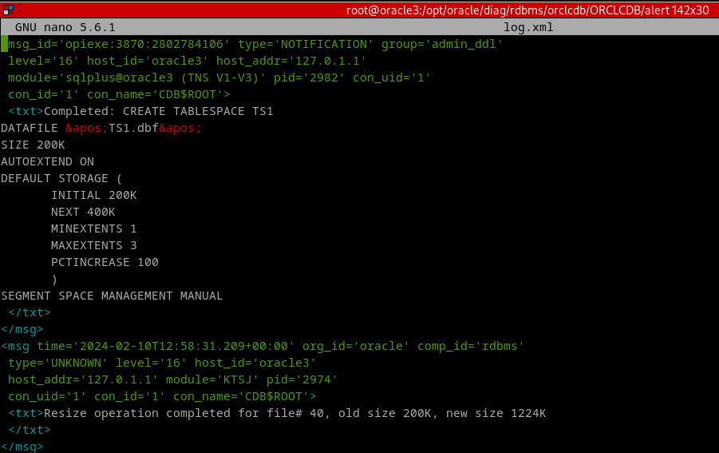
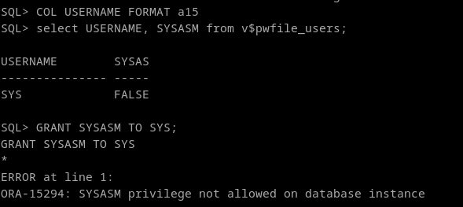
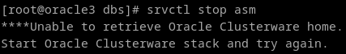

## 2. Crea dos tablas en el tablespace recién creado e inserta un registro en cada una de ellas. Comprueba el espacio libre existente en el tablespace. Borra una de las tablas y comprueba si ha aumentado el espacio disponible en el tablespace. Explica la razón.


Utilizaré la siguiente consulta para ver el espacio según vaya avanzando en el ejercicio:
```
SELECT (bytes / 1024) || 'KB' AS kilobytes
FROM DBA_FREE_SPACE
WHERE tablespace_name = 'TS1';
```


Para empezar, vemos que el tamaño disponible en TS1 es de 128kb. Esto sucede por que el tamaño de segmento mínimo (el que usa en estos casos) es 64kb (tamaño de bloque de 8kb, *8 bloques por segmento.), y oracle redondea el tamaño, en este caso da para 3 bloques 3x64 = 192kb. Uno de los bloques está siendo usado para guardar metadatos internamente, así que nos quedamos con 2, dando el valor total de 128kb

```
select distinct (bytes / 1024) || 'KB' AS kilobytes from dba_segments where tablespace_name='TS1';
select distinct blocks from dba_segments where tablespace_name='TS1';
select (block_size / 1024) || 'KB' AS kilobytes from dba_tablespaces where tablespace_name='TS1'; 
```


Creamos las tablas y volvemos a comprobar el espacio libre:
```
CREATE TABLE Tabla1 (
    id NUMBER(5)
) TABLESPACE TS1;

CREATE TABLE Tabla2 (
    id NUMBER(5)
) TABLESPACE TS1;

INSERT INTO Tabla1 VALUES (1);
INSERT INTO Tabla2 VALUES (1);
```


Vemos que el tamaño libre ha ascendido a 1024KB (1MB). Esto se debe a que oracle agrupa extensiones de bloques en grupos de 8 por defecto, ya que nuestra instalación gestiona el espacio de las tableaspaces localmente (LMT), en vez de por diccionario (DMT). En el momento que se introduce cualquier dato, el espacio mínimo pase a ser de 1mb, aun que esos datos ocupen 1 byte, como es en este caso. El espacio siempre se redondea al megabyte.

**Automatic Storage Management (ASM)**

Si creamos el tablespace para que utilice el modo manual de gestión de espacio, pero en LMT, esto no es suficiente, ya que la configuración por defecto de la instalacion dbc se sopondrá 
```
CREATE TABLESPACE TS1
DATAFILE &apos;TS1.dbf&apos;
SIZE 200K
AUTOEXTEND ON
DEFAULT STORAGE (
       INITIAL 200K
       NEXT 400K
       MINEXTENTS 1
       MAXEXTENTS 3
       PCTINCREASE 100
       )
SEGMENT SPACE MANAGEMENT MANUAL
```
(enseño el log por que hace un rato que intenté esto y se puede ver que ignora el "next")



En instalaciones standalone (sin nodos), el permiso necesario para hacer esto estará desactivado por defecto en la instancia. Se debe definir a la hora de hacer la instalación con el parametro de inicialización `INSTANCE_TYPE = ASM`, y no será posible cambiar esto sin hacer otra desde cero, ya que el disco en el que oracle está guardando datos, es el disco del sistema operativo, y utilizará los tamaños de bloque de este.

```
GRANT SYSASM TO SYS;

SELECT USERNAME, SYSASM 
FROM v$pwfile_users;
```


En caso de un server con clusters configurado podríamos simplemente utilizar la utilidad srvctl para desactivarlo de forma permanente, y gestionar el espacio de nuestros tablespaces de forma manual como viene explicado arriba.




 	

