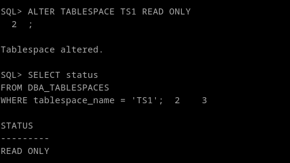
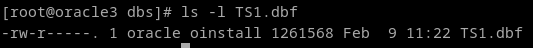
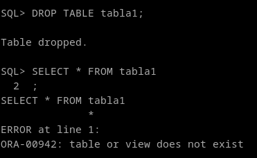
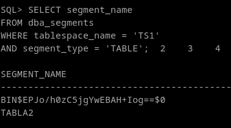
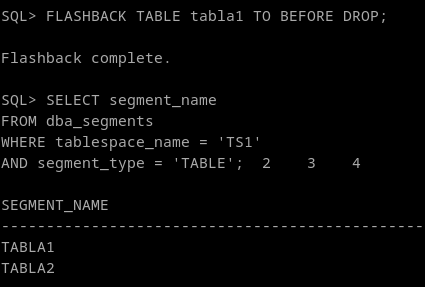
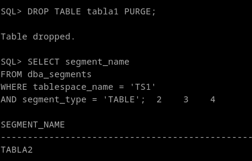
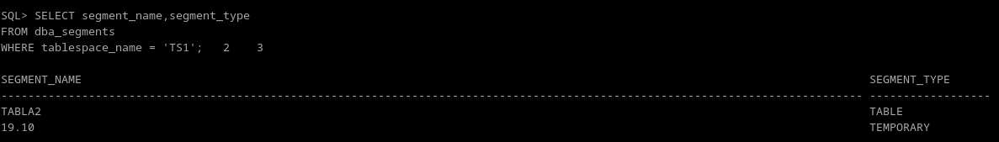

## 3. Convierte a TS1 en un tablespace de sólo lectura. Intenta insertar registros en la tabla existente. ¿Qué ocurre?. Intenta ahora borrar la tabla. ¿Qué ocurre? ¿Porqué crees que pasa eso?

Con un alter tablespace podemos convertirla en read only
```
ALTER TABLESPACE TS1 READ ONLY

SELECT status
FROM DBA_TABLESPACES 
WHERE tablespace_name = 'TS1';
```



Intentamos insertar un registro.
```
INSERT INTO Tabla1 VALUES (2)
```


Oracle como tal, no modifica los permisos del tablespaceen el sistema, si no que pone una flag para que "actue" como solo lectura, como se puede ver en la primera captura del ejercicio.




Probamos a eliminar una tabla
```
DROP TABLE tabla1;
```


Comprobamos que podemos borrarla, pero realmente solo podemos por que cuando hacemos un drop table, no la borramos directamente, si no que oracle la convierte en un segmento temporal, significando que drop no escribe nada en TS1 realmente, solo ha *"Movido la tabla a la papelera de reciclaje"*

```
SELECT segment_name
FROM dba_segments
WHERE tablespace_name = 'TS1'
AND segment_type = 'TABLE';
```


Vamos a restaurar la tabla:

```
FLASHBACK TABLE tabla1 TO BEFORE DROP;
```



Y por último, intentamos purgar la tabla, para intentar borrarla de verdad.

```
DROP TABLE tabla1 PURGE;
```


Esto también deja hacerlo, por que **TAMPOCO BORRA** una tabla, ya que lo que hace es marcar el espacio como libre. De hecho el segmento asociado a la tabla sigue existiendo, pero está marcado de forma temporal, haciendo que se cumpla la regla de no escribir en el tablespace, permitiendo cambios en la estructura del esquema.

```
SELECT segment_name,segment_type 
FROM dba_segments 
WHERE tablespace_name = 'TS1'; 
```

