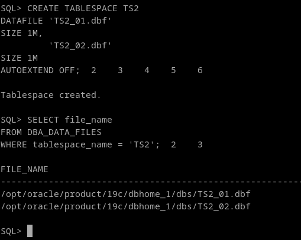
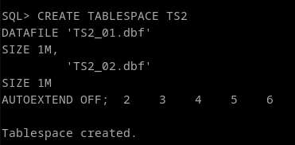
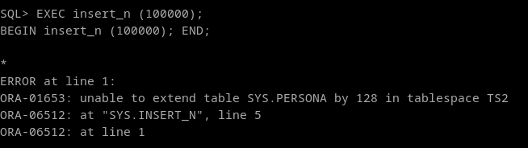
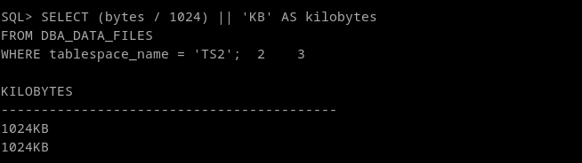
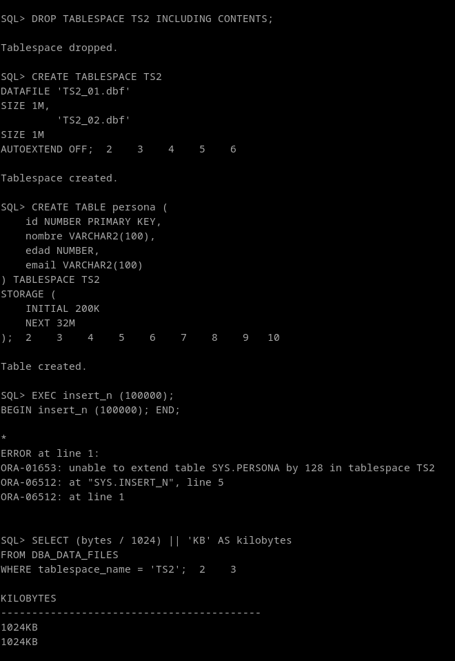
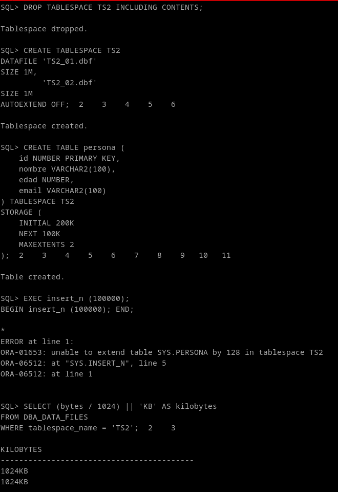

## 4. Crea un espacio de tablas TS2 con dos ficheros en rutas diferentes de 1M cada uno no autoextensibles. Crea en el citado tablespace una tabla con la clausula de almacenamiento que quieras. Inserta registros hasta que se llene el tablespace. ¿Qué ocurre?

```
CREATE TABLESPACE TS2
DATAFILE 'TS2_01.dbf' 
SIZE 1M,
         'TS2_02.dbf' 
SIZE 1M
AUTOEXTEND OFF;

SELECT file_name
FROM DBA_DATA_FILES
WHERE tablespace_name = 'TS2';
```


Para especificar clausulas de almacenamiento especificas de tablas, lo podemos hacer con la clausula Storage

```
CREATE TABLE persona (
    id NUMBER PRIMARY KEY,
    nombre VARCHAR2(100),
    edad NUMBER,
    email VARCHAR2(100)
) TABLESPACE TS2
STORAGE (
    INITIAL 200K
    NEXT 200K
);
```



insertamos registros. Para insertar muchos registros e intentar llegar al limite, he creado un pequeño procedimiento.
```
CREATE OR REPLACE PROCEDURE insert_n (p_num NUMBER) AS
    v_cont NUMBER := 1;
BEGIN
    WHILE v_cont <= p_num LOOP
        INSERT INTO persona (id, nombre, edad, email) VALUES (TO_CHAR(v_cont), TO_CHAR(v_cont), v_cont, TO_CHAR(v_cont) || '@ejemplo.com');
        v_cont := v_cont + 1;
    END LOOP;
END;
/

EXEC insert_n (100000);
```



```
SELECT (bytes / 1024) || 'KB' AS kilobytes
FROM DBA_DATA_FILES
WHERE tablespace_name = 'TS2';
```


Vemos que se ha respetado el límite del tablespace, y se ha quedado sin extensiones de espacio. Si forzamos un conflicto, vemos que se respeta el tamaño original.:

```
DROP TABLESPACE TS2 INCLUDING CONTENTS;

CREATE TABLESPACE TS2
DATAFILE 'TS2_01.dbf' 
SIZE 1M,
         'TS2_02.dbf' 
SIZE 1M
AUTOEXTEND OFF;

CREATE TABLE persona (
    id NUMBER PRIMARY KEY,
    nombre VARCHAR2(100),
    edad NUMBER,
    email VARCHAR2(100)
) TABLESPACE TS2
STORAGE (
    INITIAL 200K
    NEXT 32M
);

EXEC insert_n (100000);
```



Si el storage de la tabla es mas restrictivo:

```
DROP TABLESPACE TS2 INCLUDING CONTENTS;

CREATE TABLESPACE TS2
DATAFILE 'TS2_01.dbf' 
SIZE 1M,
         'TS2_02.dbf' 
SIZE 1M
AUTOEXTEND OFF;

CREATE TABLE persona (
    id NUMBER PRIMARY KEY,
    nombre VARCHAR2(100),
    edad NUMBER,
    email VARCHAR2(100)
) TABLESPACE TS2
STORAGE (
    INITIAL 200K
    NEXT 100K
    MAXEXTENTS 2
);

EXEC insert_n (100000);
```

