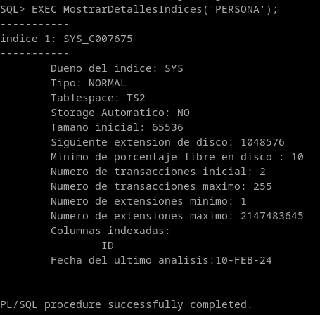

## 6. Realiza un procedimiento llamado MostrarDetallesIndices que reciba el nombre de una tabla y muestre los detalles sobre los índices que hay definidos sobre las columnas de la misma.

```
CREATE OR REPLACE PROCEDURE MostrarDetallesIndices (p_tabla VARCHAR2) AS
    CURSOR c_indexes IS
        SELECT *
        FROM DBA_INDEXES
        WHERE table_name = p_tabla;
    v_len_barra NUMBER;
BEGIN
    FOR i IN c_indexes LOOP
        v_len_barra:= length(i.INDEX_NAME);
        dbms_output.put_line(lpad('----------', v_len_barra, '-'));
        dbms_output.put_line('indice ' || c_indexes%ROWCOUNT || ': '  || i.INDEX_NAME);
        dbms_output.put_line(lpad('----------', v_len_barra, '-'));
        dbms_output.put_line(chr(9) ||'Dueno del indice: ' || i.OWNER);
        dbms_output.put_line(chr(9) ||'Tipo: ' || i.INDEX_TYPE);
        dbms_output.put_line(chr(9) ||'Tablespace: ' || i.TABLESPACE_NAME);
        IF i.AUTO = 'YES' THEN
            dbms_output.put_line(chr(9) ||'Storage Automatico: ' || i.AUTO);
            dbms_output.put_line(chr(9) ||'Tamaño inicial: ' || i.INITIAL_EXTENT);
        ELSE
            dbms_output.put_line(chr(9) ||'Storage Automatico: ' || i.AUTO);
            dbms_output.put_line(chr(9) ||'Tamano inicial: ' || i.INITIAL_EXTENT);
            dbms_output.put_line(chr(9) ||'Siguiente extension de disco: ' || i.NEXT_EXTENT);
            dbms_output.put_line(chr(9) ||'Minimo de porcentaje libre en disco : ' || i.PCT_FREE);
            dbms_output.put_line(chr(9) ||'Numero de transacciones inicial: ' || i.INI_TRANS);
            dbms_output.put_line(chr(9) ||'Numero de transacciones maximo: ' || i.MAX_TRANS);
            dbms_output.put_line(chr(9) ||'Numero de extensiones minimo: ' || i.MIN_EXTENTS);
            dbms_output.put_line(chr(9) ||'Numero de extensiones maximo: ' || i.MAX_EXTENTS);
        END IF;
        dbms_output.put_line(chr(9) ||'Columnas indexadas:');
        mostrar_columnas_indexadas(p_tabla);
        dbms_output.put_line(chr(9) ||'Fecha del ultimo analisis:' || i.LAST_ANALYZED || chr(10));
    END LOOP;
END;
/

CREATE OR REPLACE PROCEDURE mostrar_columnas_indexadas (p_tabla VARCHAR2) AS
    CURSOR c_ind_col IS
        SELECT column_name
        FROM DBA_IND_COLUMNS
        WHERE table_name = p_tabla;
BEGIN
    FOR i IN c_ind_col LOOP
        dbms_output.put_line(chr(9) || chr(9) || i.column_name);
    END LOOP;
END;
/
```

```
MostrarDetallesIndices('PERSONA');
```

