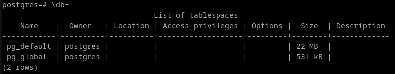
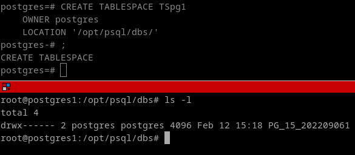
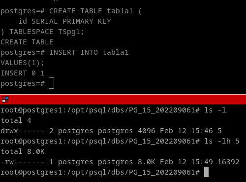
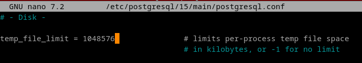
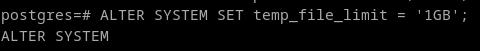
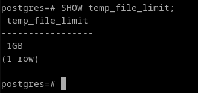

# Postgres
## 7. Averigua si existe el concepto de segmento y el de extensión en Postgres, en qué consiste y las diferencias con los conceptos correspondientes de ORACLE.

En PostgreSQL, aunque no hay un concepto directo de segmento o extensión. Los tablespaces y las tablas se guardan en ficheros y directorios del sistema. 



Vamos a crear un directorio para guardar la informacion sobre los tablespaces, en mi caso la ruta sera /opt/psql/data. y despues, definimos el tablespace:
```
mkdir /opt/psql/dbs
chown -R postgres: /opt/psql
```

Los parámetros del almacenamiento como tal es escasa en una instalación base de postgresql, habría que instalar la extensión diskquota para hacerlo directamente desde postgres (https://github.com/greenplum-db/diskquota).

En vez de eso, para utilizar la instalación base, lo único que podemos hacer es crear una partición con el espacio que queremos que el tablespace ocupe, y montarlo en nuestro directorio. Configurando el filesystem podemos controlar el espacio a nivel del sistema. Un tablespace creará un directorio donde le especifiquemos:

```
CREATE TABLESPACE TSpg1
    OWNER postgres
    LOCATION '/opt/psql/dbs/'
```



Si creamos una tabla en el tablespace, veremos que lo que hará sera generar un archivo binario dentro del directorio, que al insertar un bit, crece al tamaño de un bloque (8KB). Este tamaño no se puede modificar una vez está instalado. Para cambiarlo hay que compilar el código a mano con la opcion --with-blocksize <Tamaño> :

```
CREATE TABLE tabla1 (
    id SERIAL PRIMARY KEY
) TABLESPACE TSpg1;

INSERT INTO tabla1
VALUES(1);
```




El único parametro de postgres que controla algo del disco es el `temp_file_limit` que controla el espacio máximo que pueden ocupar los archivos temporales que postgres cree. Se puede poner un valor desde el archivo de configuración /etc/postgres/15/main/postgres.conf o con una sentencia SET (Solo hará el cambio esta sesión)





