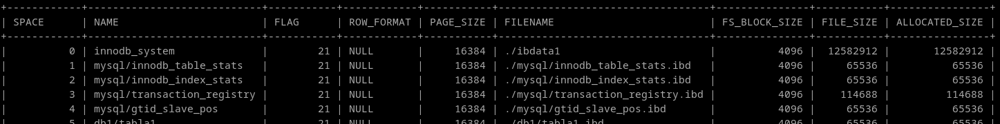
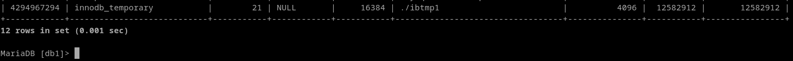
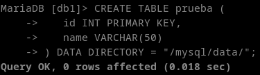
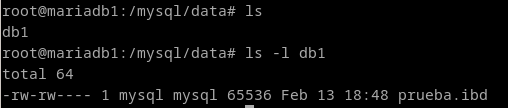

# Mysql
## Averigua si existe el concepto de espacio de tablas en MySQL y las diferencias con los tablespaces de ORACLE.

Los tablespaces en maríadb se introdujeron en la verison 5.5.5, antes de ramificarse de mysql, con la introducción de un motor llamado InnoDB, desarrollado por oracle.

Diferenciamos 3 tipos de tablespaces:

- Tablespaces del sistema: Tablespaces normales, ya sean creados por el usuario o por el sistema.



- Tablespaces de fichero-por-tabla: Directorios del filesystem específicos.


- Tablespaces temporales: Tablespace transaccional.



Los tablespaces de sistema y temporales son prácticamente iguales, pero con menos funcionalidades.

Los tablespaces de fichero por tabla son literalmente directorios del filesystem. Al crear una tabla se puede especificar el fichero donde se guardará la información. Esto creará el tablespace.

```
CREATE TABLE prueba (
   id INT PRIMARY KEY,
   name VARCHAR(50)
) DATA DIRECTORY = "/mysql/data/";
```



