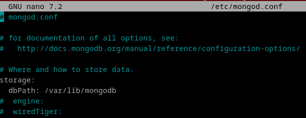

# MongoDB
## 9. Averigua si existe la posibilidad en MongoDB de decidir en qué archivo se almacena una colección.

1. Podemos especificar la ruta de guardado de los datos en el fichero de configuración, que si la instancia no está configurada como servicio, hay que crear:

```
mongod --config /etc/mongod.conf
nano /etc/mongod.conf
```




lo primero que nos da a configurar es la ruta de guardado. Podemos especificar la que queramos dentro del filesystem.
