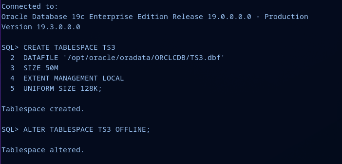
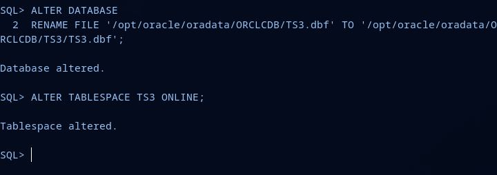
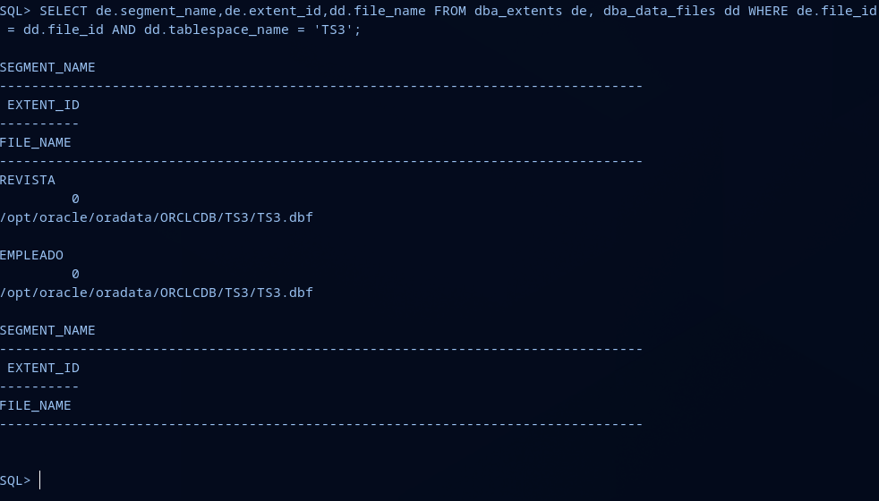
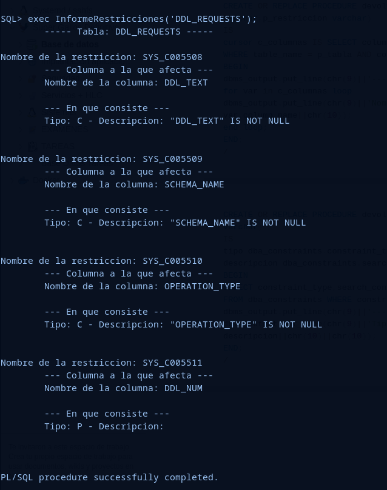
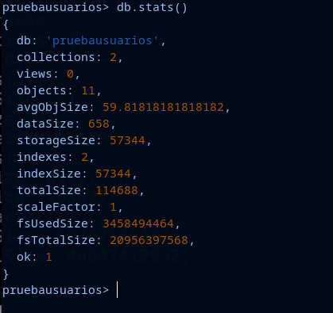
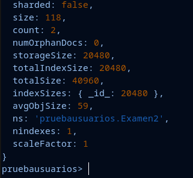

# **ASGBD - Práctica Grupal 4: Almacenamiento**

## **Alumno 3 - Fabio Gonzalez del Valle**

**Índice:**

  - [**Oracle**](#oracle)
    - [**Ejercicio 1**](#ejercicio-1)
    - [**Ejercicio 2**](#ejercicio-2)
    - [**Ejercicio 3**](#ejercicio-3)
    - [**Ejercicio 4**](#ejercicio-4)
    - [**Ejercicio 5**](#ejercicio-5)
    - [**Ejercicio 6**](#ejercicio-6)
  - [**PostgreSQL**](#postgresql)
    - [**Ejercicio 7**](#ejercicio-7)
  - [**MySQL**](#mysql)
    - [**Ejercicio 8**](#ejercicio-8)
  - [**MongoDB**](#mongodb)
    - [**Ejercicio 9**](#ejercicio-9)

---

## **Oracle**

### **Ejercicio 1**

> **1. Muestra los objetos a los que pertenecen las extensiones del tablespace TS2 (creado por Alumno 2) y el tamaño de cada una de ellas.**

### **Ejercicio 2**


> **2. Borra la tabla que está llenando TS2 consiguiendo que vuelvan a existir extensiones libres. Añade después otro fichero de datos a TS2.**

### **Ejercicio 3**


> **3. Crea el tablespace TS3 gestionado localmente con un tamaño de extension uniforme de 128K y un fichero de datos asociado. Cambia la ubicación del fichero de datos y modifica la base de datos para que pueda acceder al mismo. Crea en TS3 dos tablas e inserta registros en las mismas. Comprueba que segmentos tiene TS3, qué extensiones tiene cada uno de ellos y en qué ficheros se encuentran.**

```sql
CREATE TABLESPACE TS3
DATAFILE '/opt/oracle/oradata/ORCLCDB/TS3.dbf'
SIZE 50M
EXTENT MANAGEMENT LOCAL
UNIFORM SIZE 128K;
```

A continuación, desactivamos el tablespace.

```sql
ALTER TABLESPACE TS3 OFFLINE;
```



Crearé en mi máquina un nuevo directorio TS3 al que moveré el archivo **TS3.dbf**


Ahora, en Oracle, usaré el siguiente comando para cambiar el nombre o la ubicación de un archivo de datos físico asociado a una base de datos Oracle.

```sql
ALTER DATABASE
RENAME FILE '/opt/oracle/oradata/ORCLCDB/TS3.dbf' TO '/opt/oracle/oradata/ORCLCDB/TS3/TS3.dbf';

ALTER TABLESPACE TS3 ONLINE;
```



Lo siguiente es crear las tablas dentro de este nuevo tablespace:

```sql
CREATE TABLE Empleado
(
DNI_Empleado varchar2(10),
numreg varchar2(10),
nombre varchar2(15),
apellidos varchar2(20),
direccion varchar2(30),
f_nacimiento date,
telefono varchar2(9),
puesto varchar2(35),
nacionalidad varchar2(20)
) tablespace TS3;
INSERT INTO Empleado VALUES ('29530596E','REV-1','Angel','Suarez
Perez','Fuengirola, 4',TO_DATE('16-12-2003','DD-MM-
YYYY'),'688437812','Director editorial','ALEMAN');INSERT INTO Empleado VALUES ('31001887A','REV-1','Ramon','Ortega
Fernandez','Praza Portillo, 62, Bajos',TO_DATE('16-12-2003','DD-MM-
YYYY'),'633562134','Editor ejecutivo','ITALIANO');
INSERT INTO Empleado VALUES ('54405050E','REV-5','Andres','Jimenez
Palomar','Passeig Izan, 250, 8º A',TO_DATE('8-8-1997','DD-MM-
YYYY'),'689767555','Director creativo','AUSTRALIANO');
INSERT INTO Empleado VALUES ('82456851B','REV-2','Raul','Gonzalez
Garcia','Rúa Alejandra, 9, 5º',TO_DATE('5-5-1990','DD-MM-
YYYY'),'634253422','Corrector','AUSTRALIANO');
CREATE TABLE Revista
(
numreg varchar2(10),
titulo varchar2(25),
periocidad varchar2(15),
tipo varchar2(20),
sucursal varchar2(5)
) tablespace TS3;
INSERT INTO Revista VALUES ('REV-
1','Vistac','Semanal','Deportiva','1');
INSERT INTO Revista VALUES ('REV-2','Alumnet','Anual','Online','5');
INSERT INTO Revista VALUES ('REV-3','Bajo La
Lupa','Mensual','Científica','4');
INSERT INTO Revista VALUES ('REV-4','Punto De
Vista','Mensual','Informativa','2');
INSERT INTO Revista VALUES ('REV-
5','Enigmas','Semanal','Desconocido','3');
```

Ahora haré una consulta para mostrar los segmentos, las extensiones de cada segmento y en que fichero de TS3 se encuentran:

```sql
SELECT de.segment_name,de.extent_id,dd.file_name FROM dba_extents de, dba_data_files dd WHERE de.file_id = dd.file_id AND dd.tablespace_name = 'TS3';
```




### **Ejercicio 4**

> **4. Redimensiona los ficheros asociados a los tres tablespaces que has creado de forma que ocupen el mínimo espacio posible para alojar sus objetos.**

### **Ejercicio 5**

> **5. Realiza un procedimiento llamado InformeRestricciones que reciba el nombre de una tabla y muestre los nombres de las restricciones que tiene, a qué columna o columnas afectan y en qué consisten exactamente.**

Creo el procedimiento principal

```sql
CREATE OR REPLACE PROCEDURE InformeRestricciones (p_tabla
varchar)
IS
BEGIN
dbms_output.put_line(chr(9)||'----- Tabla: '||p_tabla||' -----'||chr(10));
devolverconjunto(p_tabla);
END;
/
```

Procedimiento que devuelve el nombre de la restricción 

```sql
CREATE OR REPLACE PROCEDURE devolverconjunto (p_tabla varchar)
IS
cursor c_restricnombre IS SELECT constraint_name FROM
dba_constraints WHERE table_name = p_tabla;
BEGIN
for var in c_restricnames loop
dbms_output.put_line('Nombre de la restriccion: '||
var.constraint_name);
devolvercolumnas(p_tabla,var.constraint_name);
devolverconsiste(var.constraint_name);
end loop;
END;
/
```

Procedimiento que devuelve las columnas afectadas por la restricción

```sql
CREATE OR REPLACE PROCEDURE devolvercolumnas (p_tabla
varchar,p_restriccion varchar)
IS
cursor c_columnas IS SELECT column_name FROM dba_cons_columns
WHERE table_name = p_tabla AND constraint_name = p_restriccion;
BEGIN
dbms_output.put_line(chr(9)||'--- Columna a la que afecta ---');
for var in c_columnas loop
dbms_output.put_line(chr(9)||'Nombre de la columna: '||
var.column_name||chr(10));
end loop;
END;
/
```

Procedimiento que devuelve el tipo de restricción y la descripción de esta

```sql
CREATE OR REPLACE PROCEDURE devolverconsiste (p_restriccion
varchar)
IS
tipo dba_constraints.constraint_type%TYPE;
descripcion dba_constraints.search_condition%TYPE;
BEGIN
SELECT constraint_type,search_condition INTO tipo,descripcion
FROM dba_constraints WHERE constraint_name = p_restriccion;
dbms_output.put_line(chr(9)||'--- En que consiste ---');
dbms_output.put_line(chr(9)||'Tipo: '||tipo||' - '||'Descripcion: '||
descripcion||chr(10)||chr(10));
END;
/
```

**Comprobación:**



Los tipos de restricciones en Oracle se definen con siglas:

- 'P' para restricciones de clave primaria.
- 'C' para restricciones de clave foránea (constraint).
- Otros tipos pueden incluir 'U' para restricciones únicas, 'R' para restricciones de chequeo (check), entre otros.

### **Ejercicio 6**

> **6. Realiza un procedimiento llamado MostrarAlmacenamientoUsuario que reciba el nombre de un usuario y devuelva el espacio que ocupan sus objetos agrupando por dispositivos y archivos:**


## **PostgreSQL**

### **Ejercicio 7**

> **7. Averigua si es posible establecer cuotas de uso sobre los tablespaces en Postgres.**

En PostgreSQL, no hay una función para asignar cuotas de uso directamente en tablespaces a nivel de usuario. Podemos lograr un control de uso de espacio por usuario o por base de datos directamente.

```sql
CREATE DATABASE ejemplo WITH OWNER = usuario TABLESPACE = ejemplo CONNECTION LIMIT = -1 TEMPLATE template0 MAXSIZE 100MB;
```

## **MySQL**

### **Ejercicio 8**

> **8. Averigua si existe el concepto de extensión en MySQL y si coincide con el existente en ORACLE.**

En MySQL, el término "extensión" se utiliza para referirse a algo diferente en comparación con el concepto de "extensión" en Oracle. Estas son las diferencias:

En MySQL, una "extensión" se refiere a un complemento opcional que agrega funcionalidades adicionales al servidor MySQL. Estas extensiones pueden ser funciones, almacenamientos de motores, plugins de autenticación, plugins de cifrado, y más.

En Oracle, una "extensión" se refiere a la capacidad de agregar nuevos métodos y atributos a un tipo de objeto definido por el usuario.

En resumen en MySQL, una extensión agrega funcionalidades adicionales al servidor MySQL, mientras que en Oracle Database, una extensión permite la herencia de atributos y métodos en tipos de objetos definidos por el usuario.

## **MongoDB:**

### **Ejercicio 9**

> **9. Averigua si en MongoDB puede saberse el espacio disponible para almacenar nuevos documentos.**

En MongoDB, podemos utilizar el método **db.stats()** en la shell de MongoDB para obtener estadísticas sobre una base de datos específica. Esto incluye información sobre el tamaño total de la base de datos, el espacio utilizado y el espacio libre.



También podemos usar el comando **db.nombrecoleccion.stats()** para obtener información sobre una colección específica de nuestra base de datos. Este comando nos otorgará una información detallada sobre la colección.



