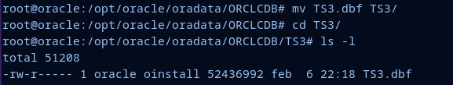

# **ASGBD - Práctica Grupal 4: Almacenamiento**

## **Alumno 3 - Fabio Gonzalez del Valle**

**Índice:**

  - [**Oracle**](#oracle)
    - [**Ejercicio 1**](#ejercicio-1)
    - [**Ejercicio 2**](#ejercicio-2)
    - [**Ejercicio 3**](#ejercicio-3)
    - [**Ejercicio 4**](#ejercicio-4)
    - [**Ejercicio 5**](#ejercicio-5)
    - [**Ejercicio 6**](#ejercicio-6)
  - [**PostgreSQL**](#postgresql)
    - [**Ejercicio 7**](#ejercicio-7)
  - [**MySQL**](#mysql)
    - [**Ejercicio 8**](#ejercicio-8)
  - [**MongoDB**](#mongodb)
    - [**Ejercicio 9**](#ejercicio-9)

---

## **Oracle**

### **Ejercicio 1**

> **1. Muestra los objetos a los que pertenecen las extensiones del tablespace TS2 (creado por Alumno 2) y el tamaño de cada una de ellas.**

```sql
SELECT SEGMENT_NAME, EXTENT_ID, BYTES FROM DBA_EXTENTS WHERE TABLESPACE_NAME = 'TS2';
```


### **Ejercicio 2**


> **2. Borra la tabla que está llenando TS2 consiguiendo que vuelvan a existir extensiones libres. Añade después otro fichero de datos a TS2.**

Para ello primero eliminamos la tabla:

```sql
drop table pacientes;
```


Una vez eliminada, añadimos un nuevo fichero de datos al tablespace:

```sql
ALTER TABLESPACE TS2 ADD DATAFILE '/opt/oracle/oradata/ORCLCDB/TS2-ext.dbf' SIZE 2M;
```


Comprobamos que el fichero se ha creado correctamente:

```sql
select tablespace_name, file_name from dba_data_files WHERE tablespace_name='TS2';
```


### **Ejercicio 3**


> **3. Crea el tablespace TS3 gestionado localmente con un tamaño de extension uniforme de 128K y un fichero de datos asociado. Cambia la ubicación del fichero de datos y modifica la base de datos para que pueda acceder al mismo. Crea en TS3 dos tablas e inserta registros en las mismas. Comprueba que segmentos tiene TS3, qué extensiones tiene cada uno de ellos y en qué ficheros se encuentran.**

En Oracle, un tablespace de extensión uniforme es un tipo de tablespace donde todas las extensiones tienen el mismo tamaño. Es decir, cuando se asigna un nuevo segmento (como una tabla o un indice) a este tipo de tablespaces, Oracle asigna una cantidad fija de espacio para esa extensión en lugar de aumentar gradualmente el tamaño de esta a medida que se necesita.

Esto hace que el disco no se fragmente y la velocidad de acceso sea menor, ya que cada extensión se guarda en bloques continuos.

```sql
CREATE TABLESPACE TS3
DATAFILE '/opt/oracle/oradata/ORCLCDB/TS3.dbf'
SIZE 50M
EXTENT MANAGEMENT LOCAL
UNIFORM SIZE 128K;
```

A continuación, desactivamos el tablespace.

```sql
ALTER TABLESPACE TS3 OFFLINE;
```


Crearé en mi máquina un nuevo directorio TS3 al que moveré el archivo **TS3.dbf**



Ahora, en Oracle, usaré el siguiente comando para cambiar el nombre o la ubicación de un archivo de datos físico asociado a una base de datos Oracle.

```sql
ALTER DATABASE
RENAME FILE '/opt/oracle/oradata/ORCLCDB/TS3.dbf' TO '/opt/oracle/oradata/ORCLCDB/TS3/TS3.dbf';

ALTER TABLESPACE TS3 ONLINE;
```


Lo siguiente es crear las tablas dentro de este nuevo tablespace:

```sql
CREATE TABLE Empleado
(
DNI_Empleado varchar2(10),
numreg varchar2(10),
nombre varchar2(15),
apellidos varchar2(20),
direccion varchar2(30),
f_nacimiento date,
telefono varchar2(9),
puesto varchar2(35),
nacionalidad varchar2(20)
) tablespace TS3;
INSERT INTO Empleado VALUES ('29530596E','REV-1','Angel','Suarez
Perez','Fuengirola, 4',TO_DATE('16-12-2003','DD-MM-
YYYY'),'688437812','Director editorial','ALEMAN');INSERT INTO Empleado VALUES ('31001887A','REV-1','Ramon','Ortega
Fernandez','Praza Portillo, 62, Bajos',TO_DATE('16-12-2003','DD-MM-
YYYY'),'633562134','Editor ejecutivo','ITALIANO');
INSERT INTO Empleado VALUES ('54405050E','REV-5','Andres','Jimenez
Palomar','Passeig Izan, 250, 8º A',TO_DATE('8-8-1997','DD-MM-
YYYY'),'689767555','Director creativo','AUSTRALIANO');
INSERT INTO Empleado VALUES ('82456851B','REV-2','Raul','Gonzalez
Garcia','Rúa Alejandra, 9, 5º',TO_DATE('5-5-1990','DD-MM-
YYYY'),'634253422','Corrector','AUSTRALIANO');
CREATE TABLE Revista
(
numreg varchar2(10),
titulo varchar2(25),
periocidad varchar2(15),
tipo varchar2(20),
sucursal varchar2(5)
) tablespace TS3;
INSERT INTO Revista VALUES ('REV-
1','Vistac','Semanal','Deportiva','1');
INSERT INTO Revista VALUES ('REV-2','Alumnet','Anual','Online','5');
INSERT INTO Revista VALUES ('REV-3','Bajo La
Lupa','Mensual','Científica','4');
INSERT INTO Revista VALUES ('REV-4','Punto De
Vista','Mensual','Informativa','2');
INSERT INTO Revista VALUES ('REV-
5','Enigmas','Semanal','Desconocido','3');
```

Ahora haré una consulta para mostrar los segmentos, las extensiones de cada segmento y en que fichero de TS3 se encuentran:

```sql
SELECT de.segment_name,de.extent_id,dd.file_name FROM dba_extents de, dba_data_files dd WHERE de.file_id = dd.file_id AND dd.tablespace_name = 'TS3';
```


### **Ejercicio 4**

> **4. Redimensiona los ficheros asociados a los tres tablespaces que has creado de forma que ocupen el mínimo espacio posible para alojar sus objetos.**

Para la realización de este ejercicio vamos a necesitar conocer el espacio total de cada tablespace y el espacio usado de cada uno de ellos, conociendo ambos datos podemos redimensionarlos para que ocupen el minimo espacio posible. 

En una primera aproximación, esto podríamos conseguirlo usando el comando:

```sql
ALTER TABLESPACE nombre_tablespace SHRINK SPACE;
```

Al ejecutar este comando, Oracle realiza las siguientes acciones:

- Analiza la distribución de los segmentos de datos dentro del tablespace.
- Reorganiza los segmentos para liberar espacio no utilizado al final de los archivos de datos.
- Reduce el tamaño de los archivos de datos asociados al tablespace al mínimo necesario para almacenar los objetos que contiene.

El problema que tenemos con esta sentencia es que **SHRINK SPACE**, solo puede ejecutarse con tablespaces **NON-SYSTEM**, es decir tablespaces que no son propios del sistema. Para comprobar el tipo de  los tablespaces que vamos a manipular podemos ejecutar la siguiente sentencia en Oracle:

```sql
SELECT TABLESPACE_NAME, CONTENTS FROM DBA_TABLESPACES;
```


Como podemos comprobar, los tablespaces son de tipo **PERMANENT**, estos tablespaces contienen datos que son permanentes y están diseñados para almacenar tablas, índices y otros objetos de la base de datos que deben conservarse a largo plazo.

Ya que no podemos utilizar la opción que vimos anteriormente, vamos a redimensionar el tamaño de los ficheros de forma manual. Para esto, primero voy a comprobar el espacio total del tablespace.

```sql
SELECT tablespace_name, SUM(bytes)/1024/1024 AS "Total"
FROM dba_data_files
WHERE tablespace_name = 'TS1'
GROUP BY tablespace_name;
```


El tamaño total es de 2 MB, ahora vamos a ver el espacio utilizado:

```sql
SELECT tablespace_name, SUM(bytes)/1024/1024 AS "Utilizado"
FROM dba_segments
WHERE tablespace_name = 'TS1'
GROUP BY tablespace_name;
```


El espacio usado es de 0.625 MB o 65536 Bytes, para comprobar que este es realmente el espacio usado, voy a crear una nueva tabla que almacenará sus datos en este tablespace TS1 y comprobaré de nuevo ambos tamaños, tanto el total como el utilizado.

```sql
create table doctores (
    cod_doctor varchar2(15) primary key,
    nombre varchar2(50) NOT NULL,
    apellidos varchar2(50) NOT NULL,
    dni varchar2(9) NOT NULL UNIQUE,
    fecha_nacimiento date NOT NULL,
    especialidad varchar2(50) default 'pediatria' NOT NULL,
    telefono varchar2(9) NOT NULL,
    direccion varchar2(50) NOT NULL
)
TABLESPACE TS1;
```

```sql
insert into doctores values ('DCBA4321', 'Paco', 'Gómez', '22555555B', TO_DATE('22/09/1968', 'dd/mm/yyyy'), 'cardiologia', '686748423', 'C/Antonio, 1, Madrid');
insert into doctores values ('HGFE5678', 'Luisa', 'Pacheco', '32982333C', TO_DATE('14/07/1991', 'dd/mm/yyyy'), 'ginecologia', '683923578', 'C/Ciervo, 2, Murcia');
insert into doctores values ('LKJI9012', 'Juan', 'López', '49234644D', TO_DATE('11/03/1989', 'dd/mm/yyyy'), 'neurologia', '974637534', 'C/Fiesta, 34, Sevilla');
insert into doctores values ('ONML3456', 'Ana', 'García', '56789012E', TO_DATE('12/12/1955', 'dd/mm/yyyy'), 'psiquiatria', '625434111', 'C/Isabel II, 25, Barcelona');
```


Como podemos comprobar, el tamaño total no ha variado, en cambio el tamaño usado si ha sido modificado. Sabiendo esto podemos hacer la reducción.

Sabemos que TS1 tiene un tamaño total de 2MB y de ellos estan usandose 0.25 MB. Haciendo un cálculo podemos obtener que el espacio libre de TS1 es 1.75 MB, ya que oracle no deja que en tamaño de reducción usemos números decimales, especificaremos que el fichero tras la redimensión va a ocupar 1MB, veremos que ocurre cuando ejecutamos esta sentencia:

```sql
ALTER DATABASE DATAFILE '/opt/oracle/product/19c/dbhome_1/dbs/TS1.dbf' RESIZE 1M;
```


Este mensaje de error indica que el tamaño especificado para redimensionar el archivo de datos es menor que el tamaño mínimo requerido. Esto ocurre porque Oracle requiere cierto espacio adicional para la administración interna y la estructura de los archivos de datos.

Vamos a hacerlo ahora pero usando el tablespace TS3:

```sql
SELECT tablespace_name, SUM(bytes)/1024/1024 AS "Total"
FROM dba_data_files
WHERE tablespace_name = 'TS3'
GROUP BY tablespace_name;

SELECT tablespace_name, SUM(bytes)/1024/1024 AS "Utilizado"
FROM dba_segments
WHERE tablespace_name = 'TS3'
GROUP BY tablespace_name;
```


Sabiendo esto, lo mínimo que podríamos redimensionar el tablespace TS3 es a 2MB aproximadamente.

```sql
ALTER DATABASE DATAFILE '/opt/oracle/oradata/ORCLCDB/TS3/TS3.dbf' RESIZE 2M;
```


Como podemos comprobar, el tamaño del fichero ha sido reducido a 2MB.


**OBSERVACIÓN:** Para conocer la ruta del fichero de datos del tablespace en nuestro sistema podemos ejecutar la siguiente sentencia:

```sql
SELECT tablespace_name, file_name
FROM dba_data_files
WHERE tablespace_name = 'nombreTS';
```

### **Ejercicio 5**

> **5. Realiza un procedimiento llamado InformeRestricciones que reciba el nombre de una tabla y muestre los nombres de las restricciones que tiene, a qué columna o columnas afectan y en qué consisten exactamente.**

Creo el procedimiento principal

```sql
CREATE OR REPLACE PROCEDURE InformeRestricciones (p_tabla
varchar)
IS
BEGIN
dbms_output.put_line(chr(9)||'----- Tabla: '||p_tabla||' -----'||chr(10));
devolverconjunto(p_tabla);
END;
/
```

Procedimiento que devuelve el nombre de la restricción 

```sql
CREATE OR REPLACE PROCEDURE devolverconjunto (p_tabla varchar)
IS
cursor c_restricnombre IS SELECT constraint_name FROM
dba_constraints WHERE table_name = p_tabla;
BEGIN
for var in c_restricnames loop
dbms_output.put_line('Nombre de la restriccion: '||
var.constraint_name);
devolvercolumnas(p_tabla,var.constraint_name);
devolverconsiste(var.constraint_name);
end loop;
END;
/
```

Procedimiento que devuelve las columnas afectadas por la restricción

```sql
CREATE OR REPLACE PROCEDURE devolvercolumnas (p_tabla
varchar,p_restriccion varchar)
IS
cursor c_columnas IS SELECT column_name FROM dba_cons_columns
WHERE table_name = p_tabla AND constraint_name = p_restriccion;
BEGIN
dbms_output.put_line(chr(9)||'--- Columna a la que afecta ---');
for var in c_columnas loop
dbms_output.put_line(chr(9)||'Nombre de la columna: '||
var.column_name||chr(10));
end loop;
END;
/
```

Procedimiento que devuelve el tipo de restricción y la descripción de esta

```sql
CREATE OR REPLACE PROCEDURE devolverconsiste (p_restriccion
varchar)
IS
tipo dba_constraints.constraint_type%TYPE;
descripcion dba_constraints.search_condition%TYPE;
BEGIN
SELECT constraint_type,search_condition INTO tipo,descripcion
FROM dba_constraints WHERE constraint_name = p_restriccion;
dbms_output.put_line(chr(9)||'--- En que consiste ---');
dbms_output.put_line(chr(9)||'Tipo: '||tipo||' - '||'Descripcion: '||
descripcion||chr(10)||chr(10));
END;
/
```

**Comprobación:**


Los tipos de restricciones en Oracle se definen con siglas:

- 'P' para restricciones de clave primaria.
- 'C' para restricciones de clave foránea (constraint).
- Otros tipos pueden incluir 'U' para restricciones únicas, 'R' para restricciones de chequeo (check), entre otros.

### **Ejercicio 6**

> **6. Realiza un procedimiento llamado MostrarAlmacenamientoUsuario que reciba el nombre de un usuario y devuelva el espacio que ocupan sus objetos agrupando por dispositivos y archivos:**


```
Usuario: NombreUsuario

		Dispositivo:xxxx

			Archivo: xxxxxxx.xxx

					Tabla1......nnn K
					…
					TablaN......nnn K
					Indice1.....nnn K
					…
					IndiceN.....nnn K

			Total Espacio en Archivo xxxxxxx.xxx: nnnnn K

			Archivo:...
			…

			
		Total Espacio en Dispositivo xxxx: nnnnnn K

		Dispositivo: yyyy
		…

	Total Espacio Usuario en la BD: nnnnnnn K
```

Procedimiento principal:


```sql
CREATE OR REPLACE PROCEDURE MostrarAlmacenamientoUsuario
(p_usuario varchar2)
IS
cursor c_tablespace is SELECT tablespace_name FROM dba_extents
WHERE owner = p_usuario GROUP BY tablespace_name;
BEGIN
dbms_output.put_line('Usuario: '||p_usuario);
for var in c_tablespace loop
obtenerdispositivo(var.tablespace_name,p_usuario);
end loop;
totalbd(p_usuario);
END;
/
```

Procedimiento para obtener el dispositivo:

```sql
CREATE OR REPLACE PROCEDURE obtenerdispositivo (p_tablespace
varchar2, p_usuario varchar2)
IS
v_guardardisp varchar2(30);
BEGIN
SELECT substr(file_name,1,INSTR(file_name,'/',1,3) - 1) INTO
v_guardardisp FROM dba_data_files WHERE tablespace_name =
p_tablespace;
dbms_output.put_line(chr(9)||'Dispositivo: '||v_guardardisp);
obtenerarchivo(p_tablespace,p_usuario);
END;
/
```

Procedimiento para obtener el archivo y el espacio total:

```sql
CREATE OR REPLACE PROCEDURE obtenerarchivo (p_tablespace
varchar2, p_usuario varchar2)
IS
v_guardoarchiv varchar2(100);
BEGIN
SELECT file_name INTO v_guardoarchiv FROM dba_data_files WHERE
tablespace_name = p_tablespace;
dbms_output.put_line(chr(9)||chr(9)||'Archivo: '||v_guardoarchiv);
obtenertamtablas(p_tablespace,p_usuario);
dbms_output.put_line(chr(9)||chr(9)||'Total Espacio en Archivo '||
v_guardoarchiv||': '||totalarch(p_tablespace,p_usuario)||' K');
END;
/
```

Procedimiento para obtener las tablas y sus tamaños:

```sql
CREATE OR REPLACE PROCEDURE obtenertamtablas (p_tablespace
varchar2,p_usuario varchar2)
IS
cursor c_tablas is SELECT table_name FROM all_tables WHERE
tablespace_name = p_tablespace AND owner = p_usuario;
v_tamatab number(10);
BEGIN
for var in c_tablas loop
SELECT bytes INTO v_tamatab FROM dba_segments WHERE owner
= p_usuario AND segment_name = var.table_name;
dbms_output.put_line(chr(9)||chr(9)||chr(9)||var.table_name||' - '||
v_tamatab||' K');
obtindices(p_tablespace,p_usuario,var.table_name);
end loop;
END;
/
```

Procedimiento para obtener los indices y sus tamaños:

```sql
CREATE OR REPLACE PROCEDURE obtindices (p_tablespace varchar2,
p_usuario varchar2, p_tabla varchar2)
IS
cursor c_indices is select index_name from dba_indexes WHERE
TABLESPACE_NAME = p_tablespace AND OWNER = p_usuario AND
TABLE_NAME = p_tabla;
v_tamaind number(10);
BEGIN
for var in c_indices loop
SELECT bytes INTO v_tamaind FROM dba_segments WHERE owner
= p_usuario AND segment_name = var.index_name;
dbms_output.put_line(chr(9)||chr(9)||chr(9)||chr(9)||
var.index_name||' - '||v_tamaind||' K');
end loop;
END;
/
```

Función para obtener el total del archivo:

```sql
CREATE OR REPLACE FUNCTION totalarch (p_tablespace varchar2,
p_usuario varchar2)
RETURN NUMBER
IS
v_totaldis number(10);
BEGIN
SELECT sum(bytes) INTO v_totaldis FROM dba_segments WHERE
tablespace_name = p_tablespace AND owner = p_usuario;
return v_totaldis;
END;
/
```

Procedimiento para obtener el tamaño total de la BD:

```sql
CREATE OR REPLACE PROCEDURE totalbd (p_usuario varchar2)
IS
v_total number(10);
BEGIN
SELECT sum(bytes) INTO v_total FROM dba_segments WHERE owner
= p_usuario;
dbms_output.put_line('Total Espacio Usuario en la BD: '||v_total||'K'||chr(10));
END;
/
```

```sql
exec MostrarAlmacenamientoUsuario('C##USRPRACTICA');
```

Comprobación: 


## **PostgreSQL**

### **Ejercicio 7**

> **7. Averigua si es posible establecer cuotas de uso sobre los tablespaces en Postgres.**

En PostgreSQL, no hay una función para asignar cuotas de uso directamente en tablespaces a nivel de usuario. Podemos lograr un control de uso de espacio por usuario o por base de datos directamente.

```sql
CREATE DATABASE ejemplo WITH OWNER = usuario TABLESPACE = ejemplo CONNECTION LIMIT = -1 TEMPLATE template0 MAXSIZE 100MB;
```

## **MySQL**

### **Ejercicio 8**

> **8. Averigua si existe el concepto de extensión en MySQL y si coincide con el existente en ORACLE.**

En MySQL, el término "extensión" se utiliza para referirse a algo diferente en comparación con el concepto de "extensión" en Oracle. Estas son las diferencias:

En MySQL, una "extensión" se refiere a un complemento opcional que agrega funcionalidades adicionales al servidor MySQL. Estas extensiones pueden ser funciones, almacenamientos de motores, plugins de autenticación, plugins de cifrado, y más.

En Oracle, una "extensión" se refiere a la capacidad de agregar nuevos métodos y atributos a un tipo de objeto definido por el usuario.

En resumen en MySQL, una extensión agrega funcionalidades adicionales al servidor MySQL, mientras que en Oracle Database, una extensión permite la herencia de atributos y métodos en tipos de objetos definidos por el usuario.

## **MongoDB:**

### **Ejercicio 9**

> **9. Averigua si en MongoDB puede saberse el espacio disponible para almacenar nuevos documentos.**

En MongoDB, podemos utilizar el método **db.stats()** en la shell de MongoDB para obtener estadísticas sobre una base de datos específica. Esto incluye información sobre el tamaño total de la base de datos, el espacio utilizado y el espacio libre.


También podemos usar el comando **db.nombrecoleccion.stats()** para obtener información sobre una colección específica de nuestra base de datos. Este comando nos otorgará una información detallada sobre la colección.


